# Wiki Documentation for https://github.com/daveio/dave-io

Generated on: 2025-06-27 19:47:03

## Table of Contents

- [Project Overview](#project-overview)
- [Technology Stack](#tech-stack)
- [Getting Started](#getting-started)
- [Architecture Overview](#architecture-overview)
- [Request Flow & Processing](#request-flow)
- [Middleware System](#middleware-system)
- [Authentication & Authorization](#authentication-system)
- [API Endpoints & OpenAPI](#api-endpoints)
- [AI Integration & Services](#ai-integration)
- [KV Storage & Data Patterns](#kv-storage)
- [Metrics & Monitoring](#metrics-tracking)
- [Nuxt Frontend Architecture](#nuxt-frontend)
- [Server Utilities & Helpers](#server-utilities)
- [Validation & Schemas](#validation-schemas)
- [Cloudflare Deployment](#cloudflare-deployment)
- [Development Workflow](#development-workflow)

<a id='project-overview'></a>

## Project Overview

### Related Pages

Related topics: [Technology Stack](#tech-stack), [Getting Started](#getting-started)

<details>
<summary>Relevant source files</summary>

The following files were used as context for generating this wiki page:

- [README.md](README.md)
- [AGENTS.md](AGENTS.md)
- [CLAUDE.md](CLAUDE.md)
- [nuxt.config.ts](nuxt.config.ts)
- [package.json](package.json)
- [test/kv-import-export.test.ts](test/kv-import-export.test.ts)
- [test/cloudflare-images.test.ts](test/cloudflare-images.test.ts)
</details>

# Project Overview

dave.io is a modern Nuxt 3 + Cloudflare Workers API platform that provides JWT authentication, AI integration, and automated OpenAPI documentation. The project serves as a comprehensive web platform with image optimization, AI-powered features, and a robust authentication system built on Cloudflare's edge computing infrastructure.

The platform follows strict development principles emphasizing breaking changes, perfect code quality, comprehensive testing, and real service integration without mocks. It implements a hierarchical JWT authentication system and provides both public and protected API endpoints for various functionalities including AI services, image processing, and URL shortening.

## Architecture Overview

The dave.io platform is built on a modern serverless architecture leveraging Cloudflare Workers for edge computing capabilities. The system integrates multiple Cloudflare services including KV storage, AI services, and Images API to provide a comprehensive web platform.

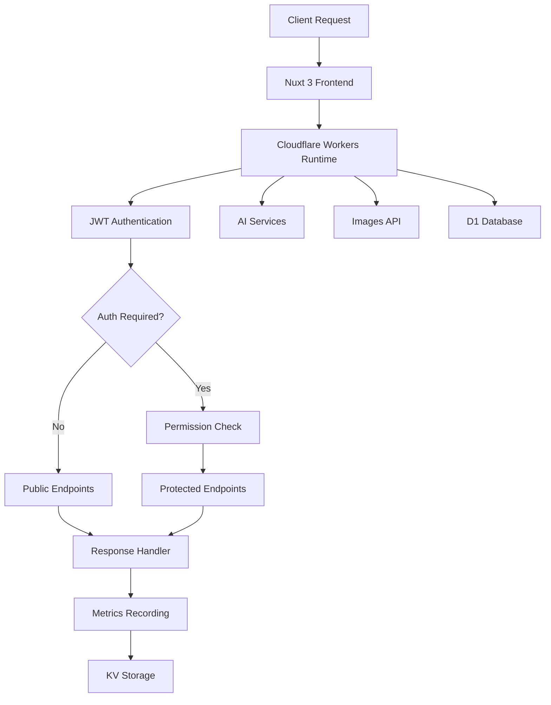
```mermaid
graph TD
    A[Client Request] --> B[Nuxt 3 Frontend]
    B --> C[Cloudflare Workers Runtime]
    C --> D[JWT Authentication]
    D --> E{Auth Required?}
    E -->|Yes| F[Permission Check]
    E -->|No| G[Public Endpoints]
    F --> H[Protected Endpoints]
    G --> I[Response Handler]
    H --> I
    I --> J[Metrics Recording]
    J --> K[KV Storage]
    C --> L[AI Services]
    C --> M[Images API]
    C --> N[D1 Database]
```

Sources: [nuxt.config.ts:1-50](), [README.md:1-100]()

## Technology Stack

The platform utilizes a carefully selected technology stack optimized for performance and developer experience:

| Component       | Technology                  | Purpose                                  |
| --------------- | --------------------------- | ---------------------------------------- |
| Runtime         | Nuxt 3 + Cloudflare Workers | Server-side rendering and edge computing |
| Authentication  | JWT + JOSE                  | Hierarchical permission system           |
| Validation      | Zod + TypeScript            | Schema validation and type safety        |
| Testing         | Vitest + HTTP API           | Unit and integration testing             |
| Package Manager | Bun                         | Fast package management and task running |
| Linting         | Biome                       | Code formatting and linting              |

Sources: [README.md:30-35](), [AGENTS.md:45-50]()

## Development Principles

The project follows "The 11 Commandments" - a strict set of development rules that ensure code quality and consistency:

### Core Rules

1. **BREAK**: Ship breaking changes freely, document in AGENTS.md, never add migration code (except database migrations)
2. **PERFECT**: Take unlimited time for correctness, refactor aggressively, no "good enough"
3. **TEST**: Test everything with logic/side effects using `bun run test`, `bun run test:ui`, `bun run test:api`
4. **SYNC**: AGENTS.md is the source of truth, update after API/feature/auth changes
5. **VERIFY**: Full build and lint pipeline must pass before continuing

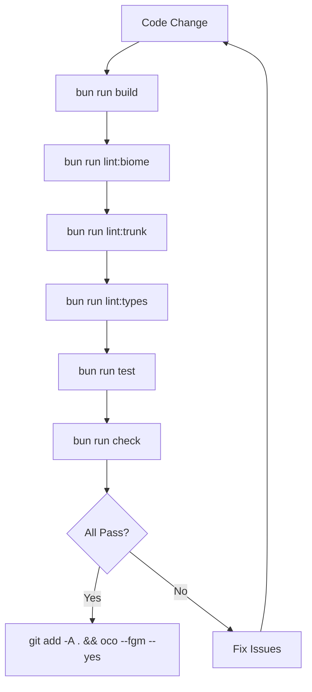
```mermaid
graph TD
    A[Code Change] --> B[bun run build]
    B --> C[bun run lint:biome]
    C --> D[bun run lint:trunk]
    D --> E[bun run lint:types]
    E --> F[bun run test]
    F --> G[bun run check]
    G --> H{All Pass?}
    H -->|Yes| I[git add -A . && oco --fgm --yes]
    H -->|No| J[Fix Issues]
    J --> A
```

Sources: [README.md:15-50](), [AGENTS.md:10-60]()

## Authentication System

The platform implements a hierarchical JWT authentication system using JOSE (JavaScript Object Signing and Encryption) for secure token management.

### JWT Structure

```typescript
{
  sub: string,    // Subject (permission scope)
  iat: number,    // Issued at timestamp
  exp?: number,   // Optional expiration
  jti?: string    // Optional JWT ID
}
```

### Permission Hierarchy

The permission system uses a hierarchical structure where parent permissions grant access to child resources:

| Category    | Resources                   | Description                |
| ----------- | --------------------------- | -------------------------- |
| `api`       | `api:tokens`, `api:metrics` | API management permissions |
| `ai`        | `ai:alt`, `ai:tickets`      | AI service permissions     |
| `dashboard` | `dashboard:admin`           | Dashboard access           |
| `admin`     | All resources               | Administrative access      |
| `*`         | All resources               | Wildcard permission        |

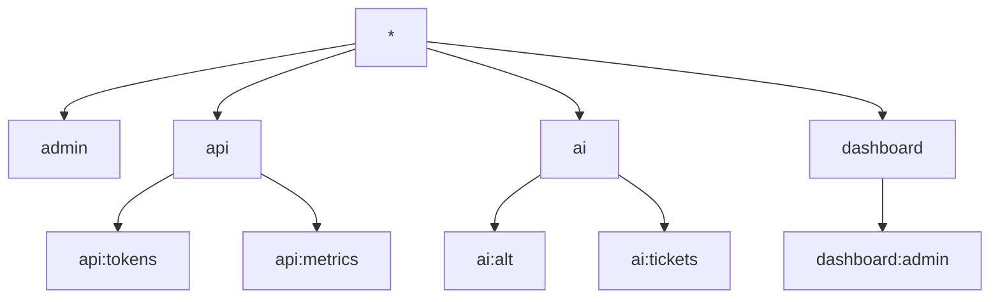
```mermaid
graph TD
    A[*] --> B[admin]
    A --> C[api]
    A --> D[ai]
    A --> E[dashboard]
    C --> F[api:tokens]
    C --> G[api:metrics]
    D --> H[ai:alt]
    D --> I[ai:tickets]
    E --> J[dashboard:admin]
```

Sources: [README.md:40-45](), [AGENTS.md:80-90]()

## API Endpoints

The platform provides both public and protected API endpoints with consistent response formatting and comprehensive validation.

### Public Endpoints

- `/api/ping` - Health check and status
- `/api/images/optimise` - Image optimization service
- `/go/{slug}` - URL shortening service
- `/api/ai/tickets/*` - AI ticket processing

### Protected Endpoints

- `/api/ai/alt` - AI alt-text generation (requires `ai:alt` permission)
- `/api/tokens/{uuid}/*` - Token management (requires `api:tokens` permission)

### Response Format

All API responses follow a standardized structure:

```typescript
// Success Response
{
  ok: true,
  result: any,
  error: null,
  status: { message: string },
  timestamp: string
}

// Error Response
{
  ok: false,
  error: string,
  status?: { message: string },
  timestamp: string
}
```

Sources: [README.md:45-55](), [AGENTS.md:90-100]()

## File Structure and Conventions

The project follows strict file naming conventions for API endpoints and utilities:

### API Endpoint Naming

```
server/api/example.get.ts          # GET /api/example
server/api/example.post.ts         # POST /api/example
server/api/users/[uuid].get.ts     # GET /api/users/{uuid}
server/api/users/[uuid]/[...path].get.ts # GET /api/users/{uuid}/{path}
server/routes/go/[slug].get.ts     # GET /go/{slug}
```

### Utility Organization

```
server/utils/                 # Shared logic
├── auth.ts                   # Authentication
├── response.ts               # API responses
├── schemas.ts                # Zod schemas
├── validation.ts             # Input validation
└── *-helpers.ts              # Specific helpers
```

Sources: [AGENTS.md:50-70]()

## Testing Strategy

The platform implements comprehensive testing across multiple layers:

### Test Types

| Test Type  | Command            | Purpose                     |
| ---------- | ------------------ | --------------------------- |
| Unit Tests | `bun run test`     | Individual function testing |
| UI Tests   | `bun run test:ui`  | User interface testing      |
| API Tests  | `bun run test:api` | HTTP endpoint testing       |
| Full Suite | `bun run test:all` | Complete test coverage      |

### Test File Organization

```
test/                         # Test files
├── *.test.ts                 # Unit tests
└── api-*.test.ts             # API integration tests
```

### Example Test Structure

```typescript
describe("Cloudflare Images Integration", () => {
  beforeEach(() => {
    vi.clearAllMocks();
  });

  it("should validate supported image formats", () => {
    const supportedFormats = ["image/jpeg", "image/png", "image/gif"];
    // Test implementation
  });
});
```

Sources: [test/cloudflare-images.test.ts:1-50](), [README.md:70-80]()

## Cloudflare Integration

The platform heavily integrates with Cloudflare services for enhanced performance and functionality:

### Service Bindings

```typescript
// Environment bindings
{
  KV: KVNamespace,           // Key-value storage
  D1: D1Database,            // SQL database
  AI: Ai,                    # AI inference
  Images: CloudflareImages   # Image processing
}
```

### KV Storage Patterns

The platform uses hierarchical key naming for efficient data organization:

```
metrics:api:ok              # API success metrics
metrics:api:error           # API error metrics
auth:token-uuid             # Authentication tokens
redirect:slug               # URL redirects
```

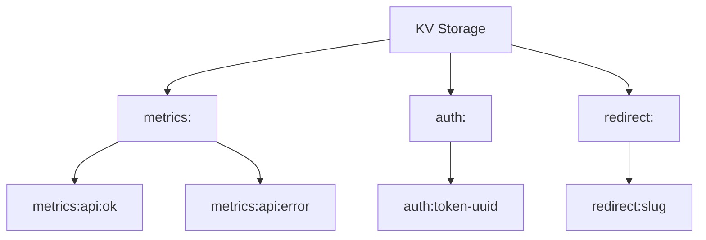
```mermaid
graph TD
    A[KV Storage] --> B[metrics:]
    A --> C[auth:]
    A --> D[redirect:]
    B --> E[metrics:api:ok]
    B --> F[metrics:api:error]
    C --> G[auth:token-uuid]
    D --> H[redirect:slug]
```

Sources: [test/kv-import-export.test.ts:20-40](), [AGENTS.md:120-130]()

## Configuration and Deployment

### Environment Variables

The platform requires specific environment variables for proper operation:

```typescript
API_JWT_SECRET              # JWT signing secret
CLOUDFLARE_API_TOKEN       # Cloudflare API access
CLOUDFLARE_ACCOUNT_ID      # Account identifier
```

### Deployment Pipeline

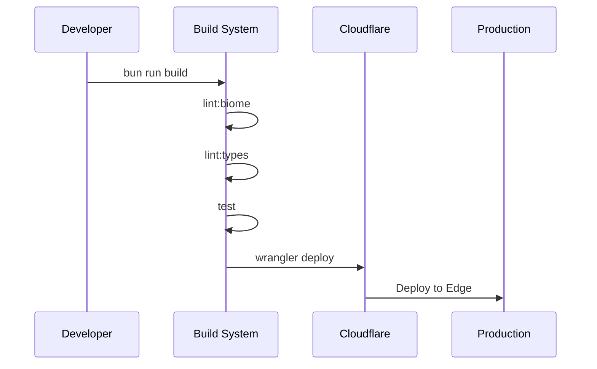
```mermaid
sequenceDiagram
    participant Dev as Developer
    participant Build as Build System
    participant CF as Cloudflare
    participant Prod as Production

    Dev->>Build: bun run build
    Build->>Build: lint:biome
    Build->>Build: lint:types
    Build->>Build: test
    Build->>CF: wrangler deploy
    CF->>Prod: Deploy to Edge
```

### Nuxt Configuration

The platform uses specific Nuxt configuration for Cloudflare Workers compatibility:

```typescript
export default defineNuxtConfig({
  nitro: {
    preset: "cloudflare_module",
    cloudflare: {
      deployConfig: true,
      nodeCompat: true,
    },
    experimental: {
      wasm: true,
    },
  },
});
```

Sources: [nuxt.config.ts:10-25](), [package.json:40-60]()

## CLI Tools and Development Workflow

The platform provides comprehensive CLI tools for development and operations:

### Available Commands

| Command   | Purpose               | Example                              |
| --------- | --------------------- | ------------------------------------ |
| `bun jwt` | JWT token management  | `bun jwt create --sub "api:metrics"` |
| `bun kv`  | KV storage operations | `bun kv export --all`                |
| `bun try` | API testing           | `bun try --auth ai alt url "..."`    |

### Development Workflow

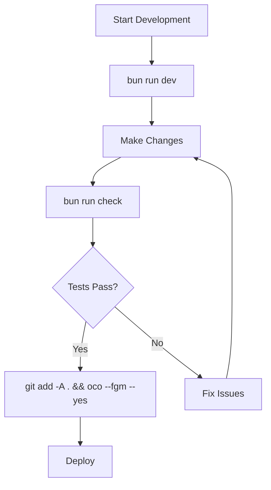
```mermaid
graph TD
    A[Start Development] --> B[bun run dev]
    B --> C[Make Changes]
    C --> D[bun run check]
    D --> E{Tests Pass?}
    E -->|Yes| F[git add -A . && oco --fgm --yes]
    E -->|No| G[Fix Issues]
    G --> C
    F --> H[Deploy]
```

Sources: [package.json:60-90](), [README.md:90-110]()

## Performance and Security

The platform implements several performance optimizations and security measures:

### Security Headers

```typescript
routeRules: {
  "/api/**": {
    headers: {
      "Cache-Control": "no-cache, no-store, must-revalidate",
      "X-Content-Type-Options": "nosniff",
      "X-Frame-Options": "DENY",
      "X-XSS-Protection": "0"
    }
  }
}
```

### Performance Optimizations

- Edge computing with Cloudflare Workers
- Hierarchical KV storage for efficient queries
- Non-blocking metrics recording
- Image optimization with global CDN

Sources: [nuxt.config.ts:25-40](), [AGENTS.md:200-220]()

## Summary

dave.io represents a comprehensive modern web platform built on Cloudflare's edge infrastructure. The project emphasizes strict development practices, comprehensive testing, and real service integration. With its hierarchical authentication system, AI integration, and robust API architecture, it provides a solid foundation for scalable web applications while maintaining high code quality standards and developer experience.

The platform's architecture leverages serverless computing, edge storage, and AI services to deliver fast, secure, and feature-rich web experiences. The strict development principles ensure maintainable code while the comprehensive tooling supports efficient development workflows.

Sources: [README.md:1-200](), [AGENTS.md:1-300]()

---

<a id='tech-stack'></a>

## Technology Stack

### Related Pages

Related topics: [Project Overview](#project-overview), [Architecture Overview](#architecture-overview)

<details>
<summary>Relevant source files</summary>

The following files were used as context for generating this wiki page:

- [package.json](package.json)
- [nuxt.config.ts](nuxt.config.ts)
- [README.md](README.md)
- [AGENTS.md](AGENTS.md)
- [CLAUDE.md](CLAUDE.md)

</details>

# Technology Stack

The dave.io platform is built on a modern, cloud-native technology stack designed for high performance, scalability, and developer productivity. The platform combines Nuxt 3 for the frontend framework with Cloudflare Workers for serverless backend execution, creating a unified full-stack application with JWT-based authentication, AI integration, and automated API documentation.

This technology stack emphasizes breaking changes over backward compatibility, real-time testing, and production-ready code quality. The architecture follows a schema-first development approach with comprehensive validation, hierarchical authentication, and extensive automation for deployment and testing workflows.

## Core Runtime & Framework

### Nuxt 3 + Cloudflare Workers Architecture

The platform uses Nuxt 3 as the primary framework with Cloudflare Workers as the deployment target, creating a serverless-first architecture:

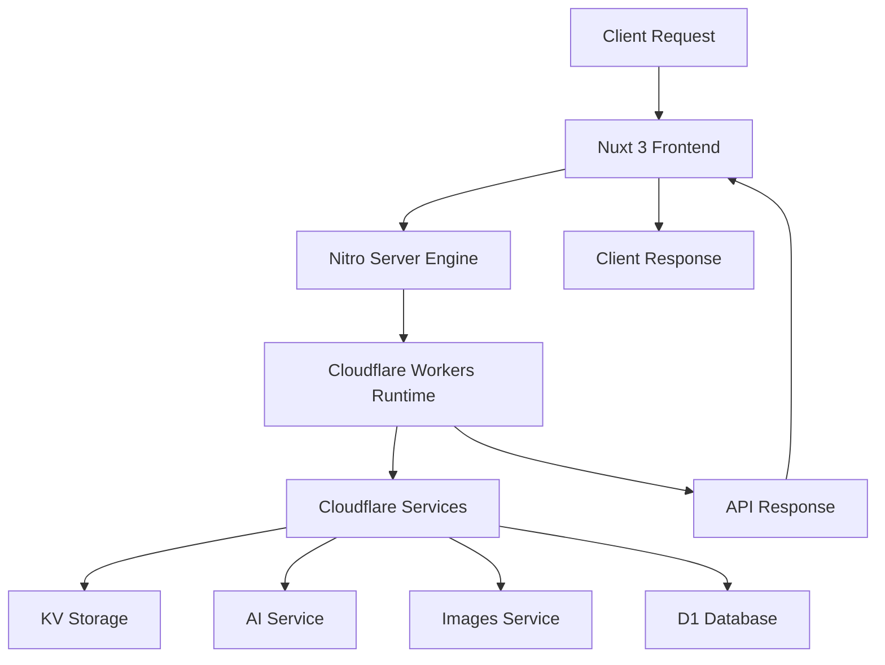
```mermaid
graph TD
    A[Client Request] --> B[Nuxt 3 Frontend]
    B --> C[Nitro Server Engine]
    C --> D[Cloudflare Workers Runtime]
    D --> E[Cloudflare Services]
    E --> F[KV Storage]
    E --> G[AI Service]
    E --> H[Images Service]
    E --> I[D1 Database]
    D --> J[API Response]
    J --> B
    B --> K[Client Response]
```

The Nuxt configuration is optimized for Cloudflare deployment with specific presets and compatibility settings:

```typescript
nitro: {
  preset: "cloudflare_module",
  cloudflare: {
    deployConfig: true,
    nodeCompat: true
  },
  experimental: {
    wasm: true
  }
}
```

Sources: [nuxt.config.ts:11-20]()

### Development Tools & Package Management

The project uses Bun as the primary package manager and runtime, with specific version requirements:

| Tool       | Version  | Purpose                      |
| ---------- | -------- | ---------------------------- |
| Bun        | ^1.2.17  | Package manager and runtime  |
| Node.js    | ^22.16.0 | Fallback runtime environment |
| TypeScript | ^5.8.3   | Type safety and development  |
| Nuxt       | ^3.17.5  | Frontend framework           |

Sources: [package.json:49-52]()

## Authentication & Security Stack

### JWT-Based Hierarchical Authentication

The platform implements a sophisticated JWT authentication system with hierarchical permissions:

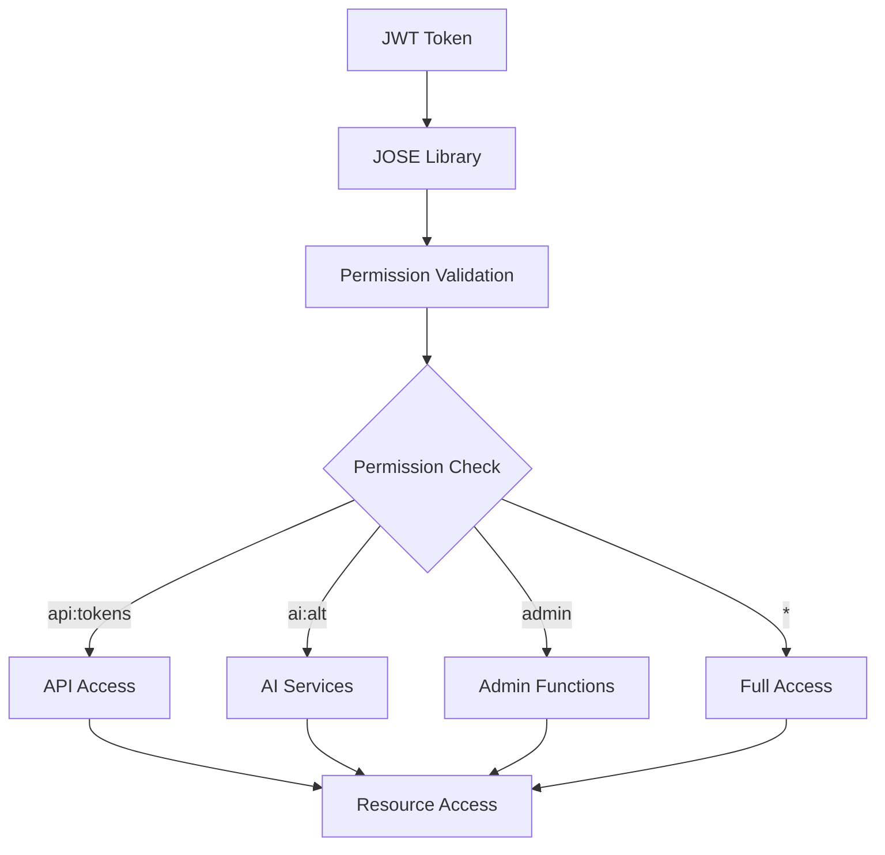
```mermaid
graph TD
    A[JWT Token] --> B[JOSE Library]
    B --> C[Permission Validation]
    C --> D{Permission Check}
    D -->|api:tokens| E[API Access]
    D -->|ai:alt| F[AI Services]
    D -->|admin| G[Admin Functions]
    D -->|*| H[Full Access]
    E --> I[Resource Access]
    F --> I
    G --> I
    H --> I
```

The JWT structure includes specific claims for authorization:

- `sub`: Subject/permissions (e.g., "api:tokens", "ai:alt")
- `iat`: Issued at timestamp
- `exp`: Optional expiration
- `jti`: Optional JWT ID for tracking

Sources: [README.md:25-27](), [AGENTS.md:71-73]()

### Security Configuration

Security headers are configured at the Nitro level for all API routes:

```typescript
"/api/**": {
  cors: true,
  headers: {
    "Cache-Control": "no-cache, no-store, must-revalidate",
    "X-Content-Type-Options": "nosniff",
    "X-Frame-Options": "DENY",
    "X-XSS-Protection": "0"
  }
}
```

Sources: [nuxt.config.ts:27-35]()

## Validation & Type Safety

### Zod Schema Validation

The platform uses Zod for comprehensive runtime validation and TypeScript integration:

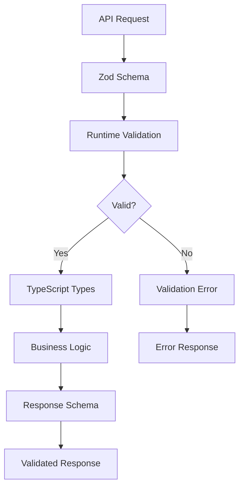
```mermaid
graph TD
    A[API Request] --> B[Zod Schema]
    B --> C[Runtime Validation]
    C --> D{Valid?}
    D -->|Yes| E[TypeScript Types]
    D -->|No| F[Validation Error]
    E --> G[Business Logic]
    F --> H[Error Response]
    G --> I[Response Schema]
    I --> J[Validated Response]
```

The validation stack includes:

- **Request Validation**: All API inputs validated with Zod schemas
- **Response Validation**: Consistent response format validation
- **OpenAPI Generation**: Automatic documentation from schemas
- **Type Safety**: End-to-end TypeScript type inference

Sources: [README.md:20](), [AGENTS.md:68]()

## Testing Infrastructure

### Multi-Layer Testing Strategy

The testing infrastructure includes multiple layers of validation:

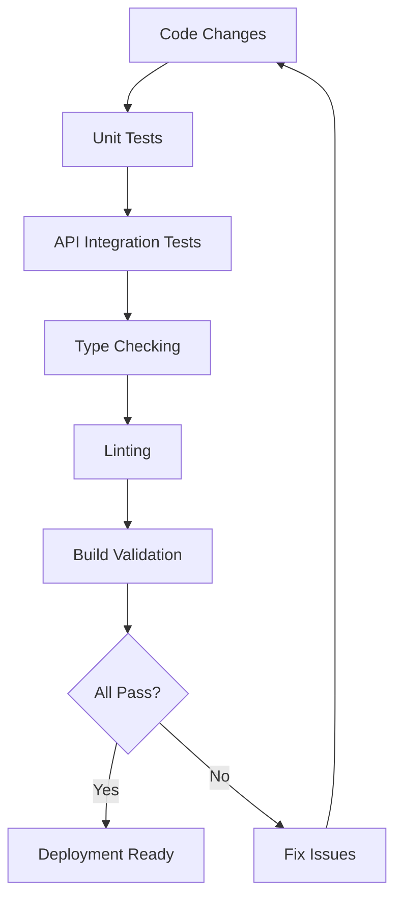
```mermaid
graph TD
    A[Code Changes] --> B[Unit Tests]
    B --> C[API Integration Tests]
    C --> D[Type Checking]
    D --> E[Linting]
    E --> F[Build Validation]
    F --> G{All Pass?}
    G -->|Yes| H[Deployment Ready]
    G -->|No| I[Fix Issues]
    I --> A
```

### Testing Tools & Commands

| Test Type  | Command              | Tool        | Purpose                       |
| ---------- | -------------------- | ----------- | ----------------------------- |
| Unit Tests | `bun run test`       | Vitest      | Component and utility testing |
| API Tests  | `bun run test:api`   | Custom HTTP | Endpoint integration testing  |
| UI Tests   | `bun run test:ui`    | Vitest UI   | Interactive test runner       |
| Type Check | `bun run lint:types` | TypeScript  | Static type validation        |
| Code Style | `bun run lint:biome` | Biome       | Code formatting and linting   |

Sources: [package.json:26-38](), [AGENTS.md:24-25]()

### Test Configuration

The testing setup uses Vitest with specific configuration for the Cloudflare environment:

```typescript
// Test environment optimized for Cloudflare Workers
export default defineConfig({
  test: {
    environment: "happy-dom",
    coverage: {
      provider: "v8",
    },
  },
});
```

Sources: [package.json:44]()

## Development Workflow & Automation

### Build Pipeline

The development workflow emphasizes automation and validation:

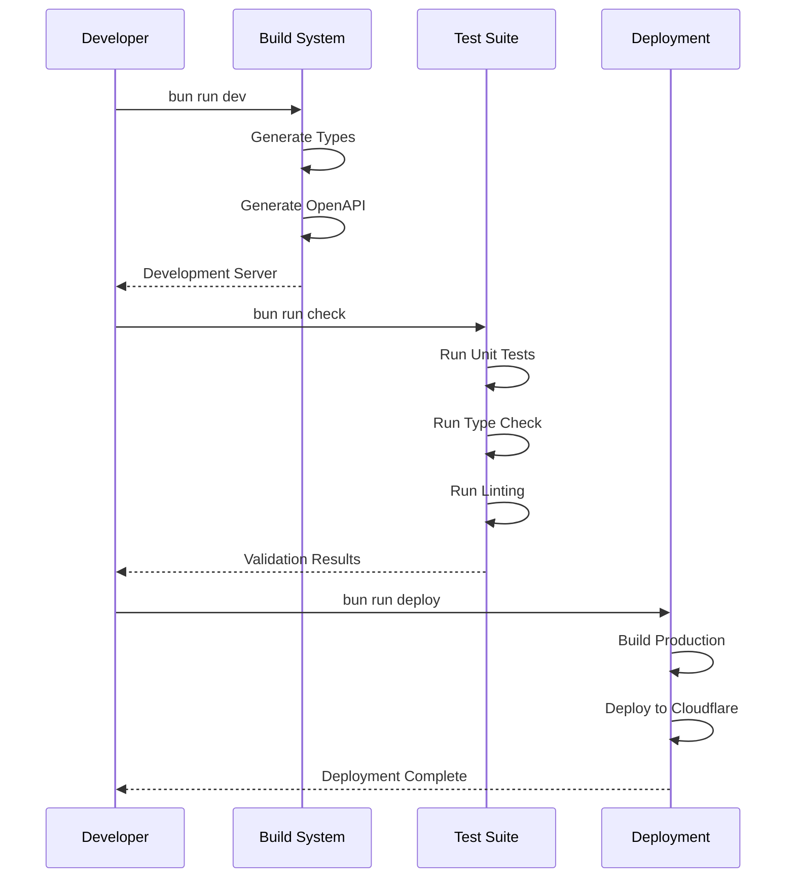
```mermaid
sequenceDiagram
    participant Dev as Developer
    participant CLI as Build System
    participant Tests as Test Suite
    participant Deploy as Deployment

    Dev->>CLI: bun run dev
    CLI->>CLI: Generate Types
    CLI->>CLI: Generate OpenAPI
    CLI-->>Dev: Development Server

    Dev->>Tests: bun run check
    Tests->>Tests: Run Unit Tests
    Tests->>Tests: Run Type Check
    Tests->>Tests: Run Linting
    Tests-->>Dev: Validation Results

    Dev->>Deploy: bun run deploy
    Deploy->>Deploy: Build Production
    Deploy->>Deploy: Deploy to Cloudflare
    Deploy-->>Dev: Deployment Complete
```

### Script Automation

The package.json defines comprehensive automation scripts:

```json
{
  "scripts": {
    "build": "bun run-s init build:nuxt",
    "check": "bun run-s build lint test:unit",
    "deploy": "bun run-s init build deploy:env deploy:wrangler",
    "dev": "bun run-s generate dev:nuxt",
    "generate": "bun run-s generate:prepare generate:types generate:openapi"
  }
}
```

Sources: [package.json:16-20]()

## Cloudflare Services Integration

### Service Bindings

The platform integrates with multiple Cloudflare services through bindings:

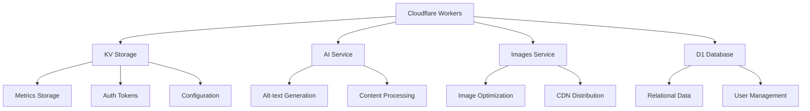
```mermaid
graph TD
    A[Cloudflare Workers] --> B[KV Storage]
    A --> C[AI Service]
    A --> D[Images Service]
    A --> E[D1 Database]

    B --> F[Metrics Storage]
    B --> G[Auth Tokens]
    B --> H[Configuration]

    C --> I[Alt-text Generation]
    C --> J[Content Processing]

    D --> K[Image Optimization]
    D --> L[CDN Distribution]

    E --> M[Relational Data]
    E --> N[User Management]
```

### Environment Configuration

Runtime configuration is managed through environment variables and Cloudflare bindings:

```typescript
runtimeConfig: {
  apiJwtSecret: process.env.API_JWT_SECRET || "dev-secret-change-in-production",
  cloudflareApiToken: process.env.CLOUDFLARE_API_TOKEN || "",
  public: {
    apiBaseUrl: process.env.NUXT_PUBLIC_API_BASE_URL || "/api"
  }
}
```

Sources: [nuxt.config.ts:51-58]()

## Frontend Technology Stack

### UI Framework & Styling

The frontend uses a modern component-based approach:

| Technology   | Purpose               | Configuration |
| ------------ | --------------------- | ------------- |
| Vue 3        | Component framework   | ^3.5.17       |
| Tailwind CSS | Utility-first styling | ^4.1.10       |
| DaisyUI      | Component library     | ^5.0.43       |
| Pinia        | State management      | ^3.0.3        |
| Nuxt Icon    | Icon system           | ^1.14.0       |

Sources: [package.json:8-19]()

### Color Mode & Theming

The platform includes dark mode support with persistent preferences:

```typescript
colorMode: {
  preference: "dark",
  fallback: "dark",
  storageKey: "nuxt-color-mode"
}
```

Sources: [nuxt.config.ts:59-63]()

## API Architecture & Documentation

### OpenAPI Integration

The platform automatically generates OpenAPI documentation from Zod schemas:

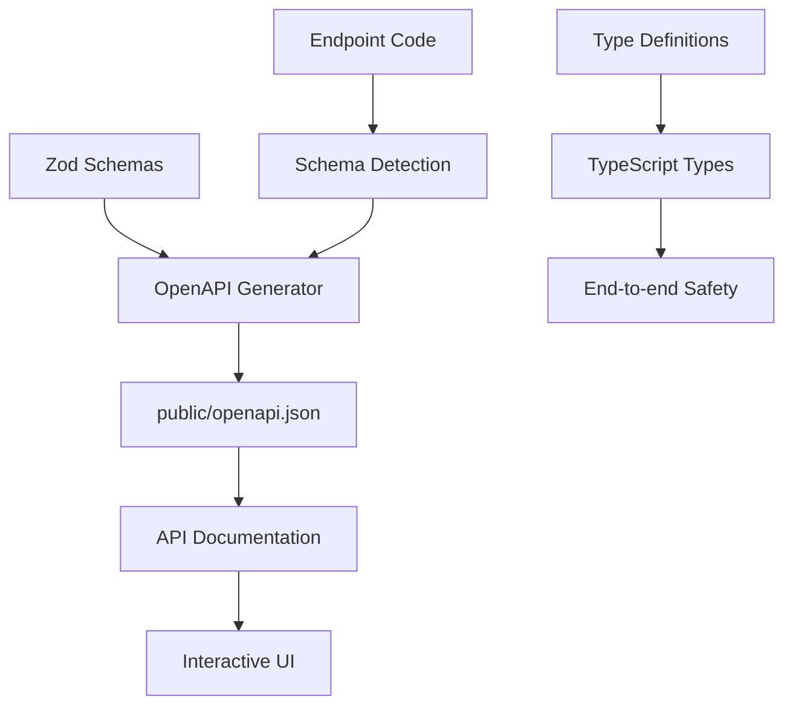
```mermaid
graph TD
    A[Zod Schemas] --> B[OpenAPI Generator]
    B --> C[public/openapi.json]
    C --> D[API Documentation]
    D --> E[Interactive UI]

    F[Endpoint Code] --> G[Schema Detection]
    G --> B

    H[Type Definitions] --> I[TypeScript Types]
    I --> J[End-to-end Safety]
```

The generation process is automated through the build pipeline:

```bash
bun run generate:openapi
```

Sources: [package.json:22]()

### Response Standardization

All API responses follow a consistent format enforced by the validation layer:

- Success: `{ok: true, result, error: null, status: {message}, timestamp}`
- Error: `{ok: false, error, status: {message}?, timestamp}`

Sources: [README.md:33](), [AGENTS.md:76]()

## Performance & Optimization

### Build Optimization

The build system is optimized for fast development cycles:

- **Startup Time**: ~3 seconds for development server
- **No Circular Dependencies**: Clean module architecture
- **Source Maps**: Enabled for debugging
- **WASM Support**: Experimental WebAssembly features

Sources: [README.md:35](), [nuxt.config.ts:6-10]()

### Caching Strategy

The platform implements strategic caching at multiple levels:

```typescript
routeRules: {
  "/api/**": {
    headers: {
      "Cache-Control": "no-cache, no-store, must-revalidate"
    }
  },
  "/go/**": {
    headers: {
      "Cache-Control": "no-cache, no-store, must-revalidate"
    }
  }
}
```

Sources: [nuxt.config.ts:26-42]()

## Development Philosophy & Standards

### The 11 Commandments

The technology stack is governed by strict development principles:

1. **BREAK**: Ship breaking changes freely, no migration code
2. **PERFECT**: Take unlimited time for correctness
3. **TEST**: Test everything with logic/side effects
4. **SYNC**: Keep documentation synchronized
5. **VERIFY**: Full validation pipeline before deployment
6. **COMMIT**: Automated commit process
7. **REAL**: Use actual service calls, no mocks
8. **COMPLETE**: Finish all code or mark TODOs
9. **TRACK**: Use 6-hex IDs for TODO tracking
10. **KV**: Simple values with hierarchical keys
11. **SHARE**: Extract duplicated logic immediately

Sources: [AGENTS.md:8-35]()

The technology stack of dave.io represents a modern, cloud-native approach to full-stack development, emphasizing developer productivity, type safety, and production reliability. The combination of Nuxt 3, Cloudflare Workers, and comprehensive tooling creates a robust foundation for building scalable web applications with AI integration and automated workflows.

---

<a id='getting-started'></a>

## Getting Started

### Related Pages

Related topics: [Project Overview](#project-overview), [Development Workflow](#development-workflow)

<details>
<summary>Relevant source files</summary>

The following files were used as context for generating this wiki page:

- [README.md](README.md)
- [AGENTS.md](AGENTS.md)
- [CLAUDE.md](CLAUDE.md)
- [nuxt.config.ts](nuxt.config.ts)
- [package.json](package.json)
- [test/kv-import-export.test.ts](test/kv-import-export.test.ts)

</details>

# Getting Started

This guide provides comprehensive instructions for setting up and developing with the dave.io platform, a modern Nuxt 3 + Cloudflare Workers API platform featuring JWT authentication, AI integration, and automated OpenAPI documentation. The platform follows strict development rules and patterns designed to ensure production-ready code with comprehensive testing and validation.

## Development Prerequisites

Before starting development, you must understand and follow the mandatory development rules. The platform enforces 11 core commandments that govern all development activities:

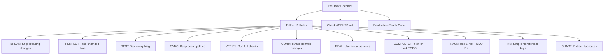
```mermaid
graph TD
    A[Pre-Task Checklist] --> B[Follow 11 Rules]
    A --> C[Check AGENTS.md]
    A --> D[Production-Ready Code]

    B --> E[BREAK: Ship breaking changes]
    B --> F[PERFECT: Take unlimited time]
    B --> G[TEST: Test everything]
    B --> H[SYNC: Keep docs updated]
    B --> I[VERIFY: Run full checks]
    B --> J[COMMIT: Auto-commit changes]
    B --> K[REAL: Use actual services]
    B --> L[COMPLETE: Finish or mark TODO]
    B --> M[TRACK: Use 6-hex TODO IDs]
    B --> N[KV: Simple hierarchical keys]
    B --> O[SHARE: Extract duplicates]
```

Sources: [README.md:8-70](), [AGENTS.md:8-70]()

## Tech Stack Overview

The platform is built on a modern technology stack optimized for Cloudflare Workers:

| Component      | Technology                  | Purpose                                   |
| -------------- | --------------------------- | ----------------------------------------- |
| Runtime        | Nuxt 3 + Cloudflare Workers | Server-side rendering and edge computing  |
| Authentication | JWT + JOSE hierarchical     | Stateless authentication with permissions |
| Validation     | Zod + TypeScript            | Schema validation and type safety         |
| Testing        | Vitest + HTTP API           | Unit and integration testing              |
| Tools          | Bun, Biome                  | Package management and code formatting    |

Sources: [README.md:75](), [AGENTS.md:75]()

## Project Setup

### Environment Configuration

The platform requires specific environment variables and Cloudflare bindings:

```bash
# Core environment variables
API_JWT_SECRET=<secret>
CLOUDFLARE_API_TOKEN=<token>
CLOUDFLARE_ACCOUNT_ID=<id>

# Cloudflare bindings
KV=<kv-namespace>
D1=<database>
AI=<ai-binding>
Images=<images-binding>
```

Sources: [README.md:1089]()

### Installation and Initial Setup

```bash
# Install dependencies
bun install

# Initialize project (generates types and docs)
bun run init

# Start development server
bun run dev
```

The initialization process runs several critical steps:

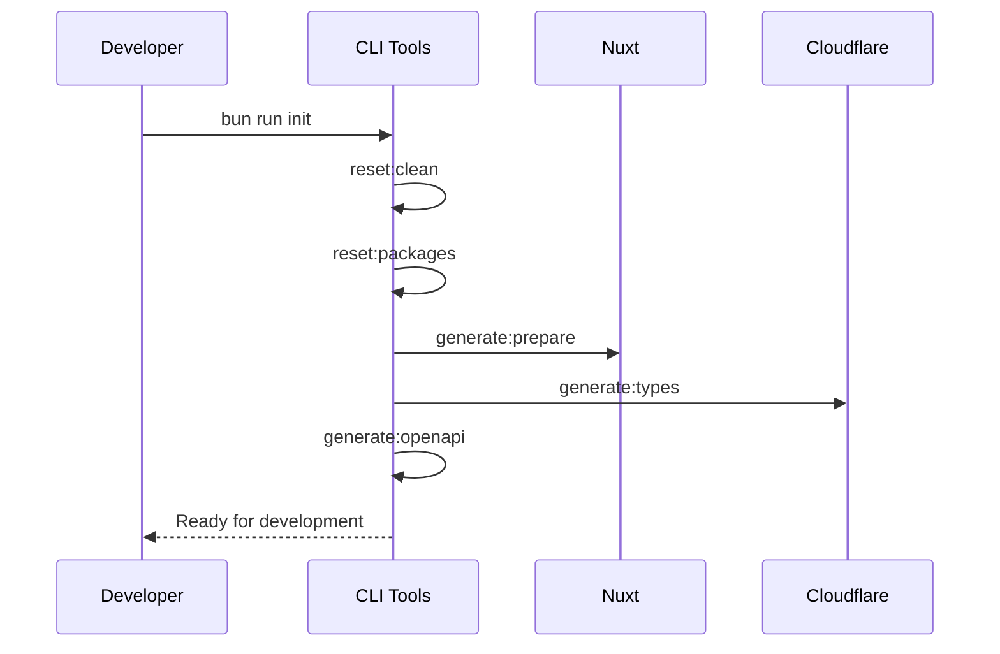
```mermaid
sequenceDiagram
    participant Dev as Developer
    participant CLI as CLI Tools
    participant Nuxt as Nuxt
    participant CF as Cloudflare

    Dev->>CLI: bun run init
    CLI->>CLI: reset:clean
    CLI->>CLI: reset:packages
    CLI->>Nuxt: generate:prepare
    CLI->>CF: generate:types
    CLI->>CLI: generate:openapi
    CLI-->>Dev: Ready for development
```

Sources: [package.json:44-45]()

### Development Workflow

The platform enforces a strict development workflow with comprehensive validation:

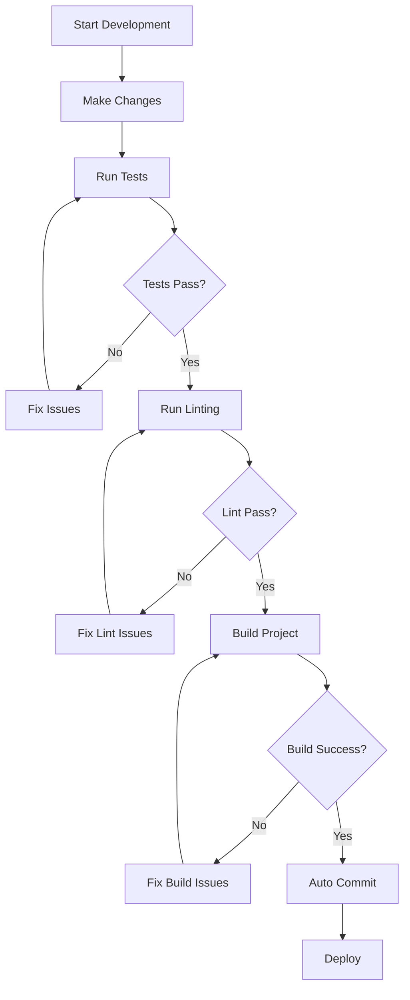
```mermaid
graph TD
    A[Start Development] --> B[Make Changes]
    B --> C[Run Tests]
    C --> D{Tests Pass?}
    D -->|No| E[Fix Issues]
    E --> C
    D -->|Yes| F[Run Linting]
    F --> G{Lint Pass?}
    G -->|No| H[Fix Lint Issues]
    H --> F
    G -->|Yes| I[Build Project]
    I --> J{Build Success?}
    J -->|No| K[Fix Build Issues]
    K --> I
    J -->|Yes| L[Auto Commit]
    L --> M[Deploy]
```

Sources: [README.md:31-33]()

## File Structure and Naming Conventions

### API Endpoints

The platform uses a specific file naming convention for API endpoints:

| Pattern            | HTTP Method        | Example                             |
| ------------------ | ------------------ | ----------------------------------- |
| `*.get.ts`         | GET                | `server/api/example.get.ts`         |
| `*.post.ts`        | POST               | `server/api/example.post.ts`        |
| `[param].get.ts`   | GET with parameter | `server/api/users/[uuid].get.ts`    |
| `[...path].get.ts` | Catch-all route    | `server/api/users/[...path].get.ts` |

Sources: [AGENTS.md:78-83]()

### Utility Organization

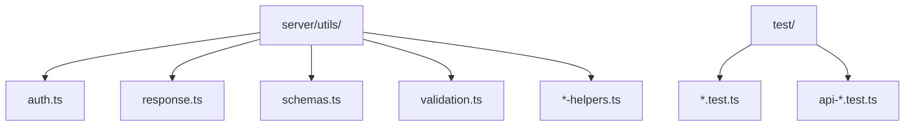
```mermaid
graph TD
    A[server/utils/] --> B[auth.ts]
    A --> C[response.ts]
    A --> D[schemas.ts]
    A --> E[validation.ts]
    A --> F[*-helpers.ts]

    G[test/] --> H[*.test.ts]
    G --> I[api-*.test.ts]
```

Sources: [AGENTS.md:85-95]()

## Authentication System

### JWT Structure and Permissions

The authentication system uses hierarchical JWT permissions:

```typescript
// JWT payload structure
{
  sub: string,    // Subject/permissions
  iat: number,    // Issued at
  exp?: number,   // Expiration (optional)
  jti?: string    // JWT ID (optional)
}
```

Permission categories follow a hierarchical model where parent permissions grant access to child resources:

| Category    | Resources             | Access Pattern              |
| ----------- | --------------------- | --------------------------- |
| `api`       | API endpoints         | `api:tokens`, `api:metrics` |
| `ai`        | AI services           | `ai:alt`, `ai:tickets`      |
| `dashboard` | Admin interface       | `dashboard:admin`           |
| `admin`     | System administration | Full access                 |
| `*`         | Wildcard              | All permissions             |

Sources: [README.md:96-99]()

### Authentication Methods

The platform supports multiple authentication methods:

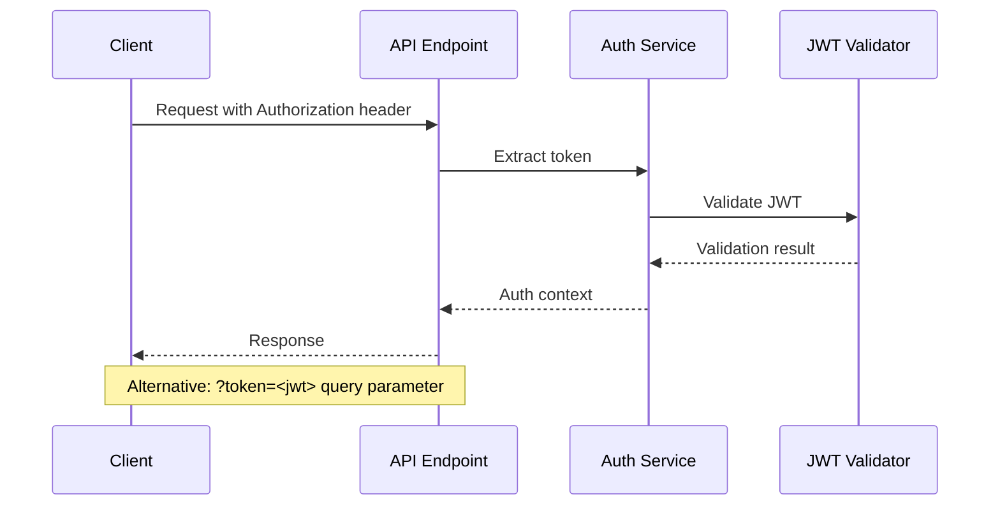
```mermaid
sequenceDiagram
    participant Client
    participant API as API Endpoint
    participant Auth as Auth Service
    participant JWT as JWT Validator

    Client->>API: Request with Authorization header
    API->>Auth: Extract token
    Auth->>JWT: Validate JWT
    JWT-->>Auth: Validation result
    Auth-->>API: Auth context
    API-->>Client: Response

    Note over Client,API: Alternative: ?token=<jwt> query parameter
```

Sources: [README.md:96]()

## Testing Framework

### Test Categories

The platform implements comprehensive testing across multiple layers:

| Test Type  | Command            | Purpose                   |
| ---------- | ------------------ | ------------------------- |
| Unit Tests | `bun run test`     | Test individual functions |
| UI Tests   | `bun run test:ui`  | Test UI components        |
| API Tests  | `bun run test:api` | Test HTTP endpoints       |
| Full Suite | `bun run test:all` | Run all tests             |

Sources: [README.md:20]()

### Test File Structure

Test files follow specific naming patterns and organizational structure:

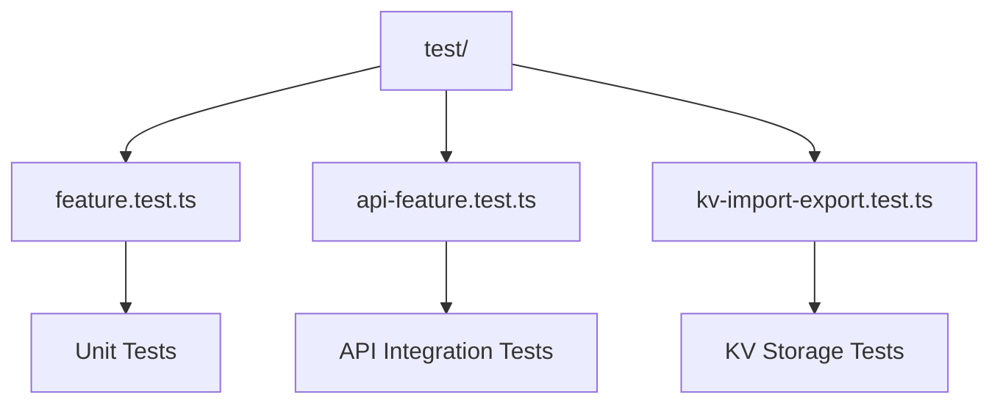
```mermaid
graph TD
    A[test/] --> B[feature.test.ts]
    A --> C[api-feature.test.ts]
    A --> D[kv-import-export.test.ts]

    B --> E[Unit Tests]
    C --> F[API Integration Tests]
    D --> G[KV Storage Tests]
```

Sources: [test/kv-import-export.test.ts:1-100]()

### Mocking Strategy

For Cloudflare services, the platform uses specific mocking patterns:

```typescript
// Example from KV testing
const mockKV = {
  get: vi.fn(),
  put: vi.fn(),
  delete: vi.fn(),
};

// AI service mocking
const mockAI = {
  run: vi.fn().mockResolvedValue({
    description: "Test alt text",
  }),
};
```

Sources: [test/kv-import-export.test.ts:15-50]()

## CLI Tools and Commands

### Core Development Commands

The platform provides comprehensive CLI tools for development workflow:

```bash
# JWT management
bun jwt init                    # Initialize JWT secret
bun jwt create --sub "api:tokens" --expiry "30d"  # Create token

# KV storage management
bun run kv export --all         # Export KV data
bun run kv import backup.yaml   # Import KV data

# API testing
bun try --auth ai alt url "https://example.com/image.jpg"  # Test with auth
bun run test:api --ai-only --url https://dave.io          # Remote testing
```

Sources: [README.md:1094-1097]()

### Validation and Quality Checks

The platform enforces strict quality checks through automated commands:

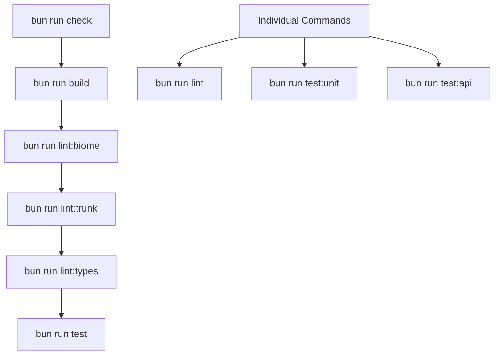
```mermaid
graph TD
    A[bun run check] --> B[bun run build]
    B --> C[bun run lint:biome]
    C --> D[bun run lint:trunk]
    D --> E[bun run lint:types]
    E --> F[bun run test]

    G[Individual Commands] --> H[bun run lint]
    G --> I[bun run test:unit]
    G --> J[bun run test:api]
```

Sources: [package.json:28]()

## Configuration and Deployment

### Nuxt Configuration

The platform uses Cloudflare-specific Nuxt configuration:

```typescript
export default defineNuxtConfig({
  nitro: {
    preset: "cloudflare_module",
    cloudflare: {
      deployConfig: true,
      nodeCompat: true,
    },
    experimental: {
      wasm: true,
    },
  },
});
```

Sources: [nuxt.config.ts:11-20]()

### Route Rules and Security Headers

The configuration includes comprehensive security headers and caching rules:

```typescript
routeRules: {
  "/api/**": {
    cors: true,
    headers: {
      "Cache-Control": "no-cache, no-store, must-revalidate",
      "X-Content-Type-Options": "nosniff",
      "X-Frame-Options": "DENY",
      "X-XSS-Protection": "0"
    }
  }
}
```

Sources: [nuxt.config.ts:25-35]()

### Deployment Process

```bash
# Full deployment workflow
bun run deploy

# Individual steps
bun run init                    # Initialize and generate
bun run build                   # Build project
bun run deploy:env             # Set environment variables
bun run deploy:wrangler        # Deploy to Cloudflare
```

Sources: [package.json:25-29]()

## Development Best Practices

### Schema-First Development

The platform enforces schema-first development with Zod validation:

1. Define schemas in `server/utils/schemas.ts` with OpenAPI metadata
2. Use `schema.parse()` in endpoints for validation
3. Export schema types: `export type Example = z.infer<typeof ExampleSchema>`
4. Generate OpenAPI documentation: `bun run generate:openapi`

Sources: [AGENTS.md:107-112]()

### Error Handling Standards

All endpoints must use standardized error handling:

```typescript
// Consistent error responses
throw createApiError(400, "Validation failed", validationDetails);

// Standardized success responses
return createApiResponse({
  result: data,
  message: "Operation successful",
  error: null,
});
```

Sources: [AGENTS.md:114-126]()

This getting started guide provides the foundation for developing with the dave.io platform. The strict adherence to the 11 commandments, comprehensive testing, and schema-first development ensures production-ready code that maintains consistency across the entire platform.

---

<a id='architecture-overview'></a>

## Architecture Overview

### Related Pages

Related topics: [Request Flow & Processing](#request-flow), [Middleware System](#middleware-system), [Technology Stack](#tech-stack)

<details>
<summary>Relevant source files</summary>

The following files were used as context for generating this wiki page:

- [README.md](README.md)
- [AGENTS.md](AGENTS.md)
- [CLAUDE.md](CLAUDE.md)
- [nuxt.config.ts](nuxt.config.ts)
- [package.json](package.json)
</details>

# Architecture Overview

The dave.io platform is a modern, cloud-native application built on Nuxt 3 and Cloudflare Workers, designed for high performance and scalability. The architecture implements a comprehensive API platform with JWT authentication, AI integration, automated OpenAPI documentation, and hierarchical permission systems. The platform follows a schema-first development approach with strict validation, comprehensive testing, and real-time service integration.

This architecture emphasizes breaking changes over backward compatibility, production-ready code quality, and extensive automation through CLI tools and testing frameworks. The system is designed to handle AI-powered features, image optimization, URL shortening, and secure token-based authentication across multiple service categories.

## Core Technology Stack

The platform is built on a carefully selected technology stack optimized for serverless deployment and developer experience:

```mermaid
graph TD
    A[Nuxt 3 Frontend] --> B[Nitro Server]
    B --> C[Cloudflare Workers Runtime]
    C --> D[Cloudflare KV Storage]
    C --> E[Cloudflare AI Services]
    C --> F[Cloudflare Images]
    C --> G[Cloudflare D1 Database]

    H[Bun Runtime] --> I[Development Tools]
    I --> J[Biome Linter]
    I --> K[Vitest Testing]
    I --> L[TypeScript]

    M[Zod Validation] --> N[OpenAPI Generation]
    O[JOSE JWT] --> P[Hierarchical Auth]
```

The technology choices reflect a commitment to modern tooling and cloud-native architecture:

| Component          | Technology                 | Purpose                               |
| ------------------ | -------------------------- | ------------------------------------- |
| Frontend Framework | Nuxt 3                     | Universal Vue.js application          |
| Server Runtime     | Nitro + Cloudflare Workers | Serverless API execution              |
| Package Manager    | Bun                        | Fast package management and execution |
| Validation         | Zod + TypeScript           | Schema-first validation               |
| Authentication     | JWT + JOSE                 | Secure token-based auth               |
| Testing            | Vitest                     | Unit and integration testing          |
| Linting            | Biome + Trunk              | Code quality enforcement              |

Sources: [README.md:17-18](), [package.json:2-45]()

## Development Philosophy & Rules

The architecture is governed by 11 mandatory commandments that shape all development decisions:

```mermaid
graph TD
    A[THE 11 COMMANDMENTS] --> B[1. BREAK: Ship breaking changes freely]
    A --> C[2. PERFECT: Take unlimited time for correctness]
    A --> D[3. TEST: Test everything with logic/side effects]
    A --> E[4. SYNC: AGENTS.md = truth]
    A --> F[5. VERIFY: Full build/lint/test pipeline]
    A --> G[6. COMMIT: Automated git workflow]
    A --> H[7. REAL: Use actual service calls only]
    A --> I[8. COMPLETE: Finish all code or mark TODO]
    A --> J[9. TRACK: TODOs use 6-hex IDs]
    A --> K[10. KV: Simple values, hierarchical keys]
    A --> L[11. SHARE: Extract duplicates immediately]
```

These rules enforce a culture of quality over speed, with explicit permission to break compatibility in favor of correctness. The architecture prioritizes real service integration over mocking, comprehensive testing over partial coverage, and immediate refactoring over technical debt accumulation.

Sources: [AGENTS.md:9-35](), [README.md:9-35]()

## Authentication & Authorization Architecture

The platform implements a sophisticated hierarchical permission system using JWT tokens with JOSE encryption:

```mermaid
sequenceDiagram
    participant Client
    participant API
    participant Auth
    participant KV

    Client->>+API: Request with Bearer token
    API->>+Auth: Validate JWT
    Auth->>Auth: Verify signature & expiry
    Auth->>+KV: Check token status
    KV-->>-Auth: Token metadata
    Auth->>Auth: Check hierarchical permissions
    Auth-->>-API: Auth result with payload
    API->>API: Process request
    API-->>-Client: Response with metrics
```

The JWT payload structure follows a minimal but extensible format:

```typescript
{
  sub: string,    // Subject/permissions (e.g., "api:tokens")
  iat: number,    // Issued at timestamp
  exp?: number,   // Optional expiration
  jti?: string    // Optional JWT ID for tracking
}
```

### Permission Hierarchy

The permission system uses a hierarchical model where parent permissions grant access to child resources:

| Category    | Resources                | Access Pattern              |
| ----------- | ------------------------ | --------------------------- |
| `*`         | All resources            | Universal access            |
| `admin`     | Administrative functions | Full system control         |
| `api`       | API endpoints            | `api:tokens`, `api:metrics` |
| `ai`        | AI services              | `ai:alt`, `ai:tickets`      |
| `dashboard` | UI components            | User interface access       |

Sources: [README.md:37-40](), [AGENTS.md:119-121]()

## API Endpoint Architecture

The API follows RESTful conventions with file-based routing and standardized response formats:

```mermaid
graph TD
    A[server/api/] --> B[example.get.ts]
    A --> C[example.post.ts]
    A --> D[users/[uuid].get.ts]
    A --> E[users/[uuid]/[...path].get.ts]

    F[server/routes/] --> G[go/[slug].get.ts]

    H[Response Format] --> I[Success: {ok: true, result, error: null}]
    H --> J[Error: {ok: false, error, status?, timestamp}]
```

### Endpoint Categories

The platform organizes endpoints into distinct categories with different authentication requirements:

**Public Endpoints:**

- `/api/ping` - System status
- `/api/images/optimise` - Image optimization
- `/go/{slug}` - URL shortening
- `/api/ai/tickets/*` - AI ticket processing

**Protected Endpoints:**

- `/api/ai/alt` - AI alt-text generation (requires `ai:alt`)
- `/api/tokens/{uuid}/*` - Token management (requires `api:tokens`)

Sources: [README.md:37-40](), [AGENTS.md:119-121]()

## Cloudflare Integration Architecture

The platform leverages multiple Cloudflare services for scalability and performance:

```mermaid
graph TD
    A[Nuxt Application] --> B[Cloudflare Workers]
    B --> C[KV Storage]
    B --> D[AI Services]
    B --> E[Images Service]
    B --> F[D1 Database]

    C --> G[Hierarchical Keys]
    G --> H[metrics:api:ok]
    G --> I[auth:token-uuid]
    G --> J[user:profile:123]

    D --> K[@cf/llava-hf/llava-1.5-7b-hf]
    E --> L[BLAKE3 IDs]
    E --> M[Global CDN]
```

### KV Storage Patterns

The architecture enforces specific patterns for KV storage to maintain consistency and performance:

- **Hierarchical Keys**: Use colon-separated namespaces (`metrics:api:ok`)
- **Simple Values**: Store only primitive values, not complex objects
- **Kebab-case**: Use kebab-case for multi-word components (`auth:token-uuid`)

### Service Bindings

The runtime configuration defines essential Cloudflare bindings:

| Binding | Type           | Purpose                    |
| ------- | -------------- | -------------------------- |
| KV      | KV Namespace   | Key-value storage          |
| D1      | Database       | SQL database               |
| AI      | AI Service     | Machine learning models    |
| Images  | Images Service | Image optimization and CDN |

Sources: [nuxt.config.ts:12-20](), [AGENTS.md:145-149]()

## Configuration & Environment Architecture

The platform uses a layered configuration approach with environment-specific overrides:

```mermaid
graph TD
    A[nuxt.config.ts] --> B[Runtime Config]
    B --> C[Server-side Variables]
    B --> D[Public Variables]

    C --> E[API_JWT_SECRET]
    C --> F[CLOUDFLARE_API_TOKEN]
    D --> G[NUXT_PUBLIC_API_BASE_URL]

    H[Cloudflare Preset] --> I[Workers Runtime]
    I --> J[Node Compatibility]
    I --> K[WASM Support]
```

### Security Configuration

The configuration implements comprehensive security headers and CORS policies:

```typescript
routeRules: {
  "/api/**": {
    cors: true,
    headers: {
      "Cache-Control": "no-cache, no-store, must-revalidate",
      "X-Content-Type-Options": "nosniff",
      "X-Frame-Options": "DENY",
      "X-XSS-Protection": "0"
    }
  }
}
```

### Static Redirects

The platform includes predefined redirects for common resources:

| Route         | Target                              | Status |
| ------------- | ----------------------------------- | ------ |
| `/cv`         | `https://cv.dave.io`                | 302    |
| `/contact`    | `https://dave.io/dave-williams.vcf` | 302    |
| `/public-key` | `https://dave.io/dave-williams.asc` | 302    |

Sources: [nuxt.config.ts:25-55]()

## Testing & Quality Assurance Architecture

The platform implements a comprehensive testing strategy across multiple layers:

```mermaid
graph TD
    A[Testing Strategy] --> B[Unit Tests]
    A --> C[Integration Tests]
    A --> D[API Tests]
    A --> E[Type Checking]

    B --> F[Vitest Framework]
    C --> G[HTTP API Testing]
    D --> H[Real Service Calls]
    E --> I[TypeScript Compiler]

    J[Quality Gates] --> K[bun run check]
    K --> L[Build Verification]
    K --> M[Lint Checks]
    K --> N[Test Execution]
```

### Testing Commands

The architecture provides specific commands for different testing scenarios:

| Command            | Purpose         | Scope                |
| ------------------ | --------------- | -------------------- |
| `bun run test`     | Unit tests      | Individual functions |
| `bun run test:ui`  | UI tests        | User interface       |
| `bun run test:api` | API tests       | HTTP endpoints       |
| `bun run check`    | Full validation | Complete pipeline    |

### Quality Enforcement

The platform enforces quality through automated tooling:

- **Biome**: Code formatting and linting
- **Trunk**: Additional code quality checks
- **TypeScript**: Type safety verification
- **Vitest**: Test execution and coverage

Sources: [AGENTS.md:17](), [package.json:34-45]()

## CLI Tools & Automation Architecture

The platform provides extensive CLI tooling for development and operations:

```mermaid
graph TD
    A[CLI Tools] --> B[JWT Management]
    A --> C[KV Operations]
    A --> D[API Testing]
    A --> E[Deployment]

    B --> F[bun jwt create]
    B --> G[bun jwt verify]
    B --> H[bun jwt list]

    C --> I[bun kv export]
    C --> J[bun kv import]
    C --> K[bun kv list]

    D --> L[bun try --auth]
    D --> M[bun try --token]

    E --> N[bun run deploy]
    E --> O[wrangler deploy]
```

### Automation Workflows

The architecture emphasizes automation through integrated workflows:

1. **Development**: `bun run dev` - Starts development server with hot reload
2. **Building**: `bun run build` - Compiles and optimizes for production
3. **Testing**: `bun run test:all` - Executes complete test suite
4. **Deployment**: `bun run deploy` - Deploys to Cloudflare Workers

Sources: [package.json:25-33](), [README.md:71-75]()

## Data Flow & Processing Architecture

The platform implements a standardized data flow pattern across all endpoints:

```mermaid
sequenceDiagram
    participant Client
    participant Endpoint
    participant Validation
    participant Business
    participant Services
    participant Response

    Client->>+Endpoint: HTTP Request
    Endpoint->>+Validation: Parse & Validate
    Validation->>Validation: Zod Schema Check
    Validation-->>-Endpoint: Validated Data
    Endpoint->>+Business: Process Logic
    Business->>+Services: External Calls
    Services-->>-Business: Service Results
    Business-->>-Endpoint: Processed Data
    Endpoint->>+Response: Format Response
    Response->>Response: Add Metadata
    Response-->>-Endpoint: Standard Format
    Endpoint-->>-Client: JSON Response
```

### Schema-First Development

The architecture enforces schema-first development with automatic OpenAPI generation:

1. **Define**: Create Zod schemas with OpenAPI metadata
2. **Validate**: Use `schema.parse()` in endpoints
3. **Generate**: Run `bun run generate:openapi`
4. **Document**: Automatic API documentation

Sources: [README.md:87-95](), [AGENTS.md:75-85]()

## Summary

The dave.io architecture represents a modern, cloud-native platform designed for scalability, security, and developer productivity. The system's foundation on Nuxt 3 and Cloudflare Workers provides serverless scalability, while the comprehensive tooling and automation ensure code quality and rapid development cycles.

Key architectural strengths include the hierarchical authentication system, schema-first API development, comprehensive testing strategy, and extensive CLI automation. The platform's commitment to breaking changes over backward compatibility enables rapid evolution and technical debt prevention.

The integration with Cloudflare services provides enterprise-grade performance and reliability, while the development philosophy ensures maintainable, well-tested code that can scale with organizational needs.

Sources: [README.md:1-4](), [AGENTS.md:1-8]()

---

<a id='request-flow'></a>

## Request Flow & Processing

### Related Pages

Related topics: [Architecture Overview](#architecture-overview), [Middleware System](#middleware-system), [API Endpoints & OpenAPI](#api-endpoints)

<details>
<summary>Relevant source files</summary>

The following files were used as context for generating this wiki page:

- [server/middleware/cors.ts](server/middleware/cors.ts)
- [server/middleware/error.ts](server/middleware/error.ts)
- [server/middleware/metrics.ts](server/middleware/metrics.ts)
- [server/middleware/shell-scripts.ts](server/middleware/shell-scripts.ts)
- [server/utils/response.ts](server/utils/response.ts)
- [server/utils/formatters.ts](server/utils/formatters.ts)
- [test/kv-import-export.test.ts](test/kv-import-export.test.ts)
- [README.md](README.md)
- [AGENTS.md](AGENTS.md)
- [CLAUDE.md](CLAUDE.md)

</details>

# Request Flow & Processing

The dave.io platform implements a comprehensive request flow and processing system built on Nuxt 3 and Cloudflare Workers. The system handles HTTP requests through a series of middleware layers that provide CORS support, error handling, metrics collection, and response formatting. This architecture ensures consistent API behavior, proper error handling, and comprehensive monitoring across all endpoints.

The request processing pipeline follows a standardized approach where incoming requests pass through middleware layers before reaching endpoint handlers, with each layer adding specific functionality like authentication, validation, metrics recording, and response formatting.

## Request Processing Pipeline

The request flow follows a structured pipeline where middleware components process requests in a specific order:

```mermaid
graph TD
    A[Incoming Request] --> B[CORS Middleware]
    B --> C[Error Handling Middleware]
    C --> D[Metrics Middleware]
    D --> E[Shell Scripts Middleware]
    E --> F[Endpoint Handler]
    F --> G[Response Formatting]
    G --> H[Metrics Recording]
    H --> I[Final Response]

    style A fill:#e1f5fe
    style I fill:#e8f5e8
    style F fill:#fff3e0
```

Sources: [server/middleware/cors.ts](), [server/middleware/error.ts](), [server/middleware/metrics.ts](), [server/middleware/shell-scripts.ts]()

## CORS Configuration

The CORS middleware provides cross-origin resource sharing configuration for the API endpoints. The system implements a permissive CORS policy suitable for development and API access:

```typescript
export default defineEventHandler(async (event) => {
  setHeaders(event, {
    "Access-Control-Allow-Origin": "*",
    "Access-Control-Allow-Methods": "GET, POST, PUT, DELETE, OPTIONS",
    "Access-Control-Allow-Headers": "Content-Type, Authorization",
  });

  if (getMethod(event) === "OPTIONS") {
    return "";
  }
});
```

### CORS Headers Configuration

| Header                       | Value                           | Purpose                         |
| ---------------------------- | ------------------------------- | ------------------------------- |
| Access-Control-Allow-Origin  | \*                              | Allows requests from any origin |
| Access-Control-Allow-Methods | GET, POST, PUT, DELETE, OPTIONS | Permitted HTTP methods          |
| Access-Control-Allow-Headers | Content-Type, Authorization     | Allowed request headers         |

Sources: [server/middleware/cors.ts:1-12]()

## Error Handling System

The error handling middleware provides centralized error processing and response formatting. It ensures consistent error responses across all API endpoints:

```mermaid
sequenceDiagram
    participant Client
    participant ErrorMiddleware
    participant Handler
    participant ResponseUtils

    Client->>+ErrorMiddleware: HTTP Request
    ErrorMiddleware->>+Handler: Process Request
    Handler-->>-ErrorMiddleware: Throws Error
    ErrorMiddleware->>+ResponseUtils: Format Error Response
    ResponseUtils-->>-ErrorMiddleware: Formatted Response
    ErrorMiddleware-->>-Client: Error Response
```

The error handling system processes different types of errors and formats them into standardized API responses. When an error occurs during request processing, the middleware catches it and transforms it into a consistent error response format.

Sources: [server/middleware/error.ts](), [server/utils/response.ts]()

## Metrics Collection

The metrics middleware automatically tracks API usage and performance metrics for all requests. It records both successful requests and errors:

```typescript
// Metrics are recorded for successful requests
recordAPIMetrics(event, statusCode);

// Error metrics are tracked separately
recordAPIErrorMetrics(event, error);
```

### Metrics Data Structure

The system tracks several key metrics:

| Metric              | Type    | Description                    |
| ------------------- | ------- | ------------------------------ |
| total_requests      | counter | Total number of API requests   |
| successful_requests | counter | Number of successful requests  |
| failed_requests     | counter | Number of failed requests      |
| redirect_clicks     | counter | Number of redirect link clicks |

Sources: [server/middleware/metrics.ts](), [README.md:245-250]()

## Response Formatting

The response formatting system ensures consistent API responses across all endpoints. All successful responses follow a standardized structure:

```typescript
{
  ok: true,
  result: data,
  message: "Operation successful",
  error: null,
  timestamp: "2024-01-01T00:00:00.000Z"
}
```

### Response Format Handlers

The system supports multiple response formats through the formatters utility:

```mermaid
graph TD
    A[Response Data] --> B{Format Type}
    B -->|json| C[JSON Response]
    B -->|yaml| D[YAML Response]
    B -->|prometheus| E[Prometheus Metrics]
    B -->|text| F[Plain Text]

    C --> G[Client Response]
    D --> G
    E --> G
    F --> G
```

The `handleResponseFormat` function centralizes format switching logic and supports JSON, YAML, Prometheus, and text formats based on query parameters.

Sources: [server/utils/formatters.ts:65-85](), [server/utils/response.ts]()

## Shell Scripts Middleware

The shell scripts middleware provides security controls for script execution within the platform. It implements safeguards to prevent unauthorized script execution:

```typescript
// Shell script execution controls
// Prevents unauthorized command execution
// Validates script permissions and context
```

This middleware ensures that any shell script execution is properly authorized and controlled, maintaining system security.

Sources: [server/middleware/shell-scripts.ts]()

## Authentication Flow

The request processing includes JWT-based authentication for protected endpoints. The authentication system uses hierarchical permissions:

```mermaid
sequenceDiagram
    participant Client
    participant AuthMiddleware
    participant JWTVerifier
    participant PermissionChecker
    participant Handler

    Client->>+AuthMiddleware: Request with JWT
    AuthMiddleware->>+JWTVerifier: Verify Token
    JWTVerifier-->>-AuthMiddleware: Token Valid
    AuthMiddleware->>+PermissionChecker: Check Permissions
    PermissionChecker-->>-AuthMiddleware: Permission Granted
    AuthMiddleware->>+Handler: Process Request
    Handler-->>-AuthMiddleware: Response
    AuthMiddleware-->>-Client: Authenticated Response
```

### Permission Categories

| Category  | Description            | Example Resources |
| --------- | ---------------------- | ----------------- |
| api       | API access permissions | tokens, metrics   |
| ai        | AI service permissions | alt-text, tickets |
| dashboard | Dashboard access       | admin, management |
| admin     | Administrative access  | all resources     |
| \*        | Wildcard permission    | everything        |

Sources: [README.md:15-17](), [AGENTS.md:45-47]()

## Error Response Structure

Error responses follow a consistent format that provides detailed information about failures:

```typescript
{
  ok: false,
  error: "Error message",
  status: {
    message: "Detailed status information"
  },
  timestamp: "2024-01-01T00:00:00.000Z"
}
```

The error handling system processes different error types including validation errors, authentication failures, and internal server errors, formatting them into this standardized structure.

Sources: [server/utils/response.ts](), [README.md:30-32]()

## Performance Optimization

The request processing system includes several performance optimizations:

### KV Storage Patterns

The system uses hierarchical KV storage keys for efficient data retrieval:

```typescript
// Hierarchical key structure
"metrics:api:ok";
"metrics:api:error";
"auth:token-uuid";
```

### Async Operations

Non-blocking operations are used for metrics recording to avoid impacting response times:

```typescript
// Fire-and-forget metrics recording
recordAPIMetricsAsync(event, statusCode);
```

Sources: [README.md:60-65](), [AGENTS.md:85-90]()

## Testing Integration

The request flow includes comprehensive testing patterns for validation:

```typescript
// API testing commands
bun run test:api              // HTTP API tests
bun run test:api --ai-only    // AI-specific tests
bun run test:api --auth       // Authentication tests
```

The testing system validates the entire request flow from middleware processing through response formatting.

Sources: [test/kv-import-export.test.ts:1-50](), [README.md:75-80]()

## Summary

The request flow and processing system in dave.io provides a robust, scalable architecture for handling HTTP requests. Through its layered middleware approach, the system ensures consistent CORS handling, comprehensive error management, detailed metrics collection, and standardized response formatting. The authentication system provides fine-grained access control, while performance optimizations ensure efficient request processing. This architecture supports the platform's requirements for reliability, security, and observability across all API endpoints.

---

<a id='middleware-system'></a>

## Middleware System

### Related Pages

Related topics: [Request Flow & Processing](#request-flow), [Metrics & Monitoring](#metrics-tracking), [Server Utilities & Helpers](#server-utilities)

<details>
<summary>Relevant source files</summary>

The following files were used as context for generating this wiki page:

- [server/middleware/metrics.ts](server/middleware/metrics.ts)
- [README.md](README.md)
- [AGENTS.md](AGENTS.md)
- [CLAUDE.md](CLAUDE.md)
- [nuxt.config.ts](nuxt.config.ts)
</details>

# Middleware System

The middleware system in dave.io provides essential cross-cutting functionality for the Nuxt 3 + Cloudflare Workers platform. It implements non-blocking metrics collection, error handling, and request processing capabilities that integrate seamlessly with Cloudflare's edge infrastructure. The middleware operates as a collection of specialized handlers that can be invoked directly by API endpoints rather than following traditional automatic middleware chains.

The system is designed around the principle of real service integration with Cloudflare Workers bindings (KV, AI, Images) and emphasizes performance through asynchronous operations that don't block request responses.

## Architecture Overview

The middleware system follows a function-based approach where individual middleware components are imported and called explicitly by API endpoints when needed. This design provides fine-grained control over which middleware functionality is applied to specific routes.

```mermaid
graph TD
    A[API Endpoint] --> B[Import Middleware Functions]
    B --> C[recordAPIMetrics]
    B --> D[recordAPIErrorMetrics]
    C --> E[updateAPIRequestMetricsAsync]
    D --> E
    E --> F[Cloudflare KV Storage]

    G[H3 Event] --> H[Extract Request Data]
    H --> I[URL, Method, Headers]
    H --> J[Cloudflare Request Info]
    I --> E
    J --> E
```

Sources: [server/middleware/metrics.ts:1-60]()

## Metrics Middleware

### Core Functionality

The metrics middleware provides automated tracking of API request patterns, response codes, and performance data. It operates through two primary functions that handle success and error scenarios respectively.

```mermaid
sequenceDiagram
    participant API as API Endpoint
    participant MM as Metrics Middleware
    participant KV as Cloudflare KV
    participant CF as Cloudflare Info

    API->>+MM: recordAPIMetrics(event, 200)
    MM->>CF: getCloudflareRequestInfo(event)
    CF-->>MM: Request metadata
    MM->>MM: Extract URL, method, headers
    MM->>KV: updateAPIRequestMetricsAsync()
    Note over MM,KV: Fire and forget - non-blocking
    MM-->>-API: Return immediately
```

### Implementation Details

The metrics system extracts comprehensive request information and stores it asynchronously in Cloudflare KV storage using hierarchical keys.

```typescript
export function recordAPIMetrics(event: H3Event, statusCode = 200): void {
  try {
    const env = getCloudflareEnv(event);
    if (!env?.KV) {
      return; // Skip metrics if KV is not available
    }

    const url = getRequestURL(event);
    const method = getMethod(event);
    const cfInfo = getCloudflareRequestInfo(event);
    const userAgent = getHeader(event, "user-agent") || "";

    // Fire and forget using the async version
    updateAPIRequestMetricsAsync(env.KV, url.pathname, method, statusCode, cfInfo, userAgent);
  } catch (error) {
    console.error("Failed to record API metrics:", error);
    // Never let metrics errors break the request
  }
}
```

Sources: [server/middleware/metrics.ts:12-32]()

### Error Metrics Handling

The system provides specialized error tracking that automatically extracts status codes from error objects and records them appropriately.

```typescript
export function recordAPIErrorMetrics(event: H3Event, error: unknown): void {
  let statusCode = 500;

  // Extract status code from error if it's an API error
  if (error && typeof error === "object" && "statusCode" in error) {
    statusCode = (error as any).statusCode || 500;
  }

  recordAPIMetrics(event, statusCode);
}
```

Sources: [server/middleware/metrics.ts:42-53]()

## Integration Patterns

### Usage in API Endpoints

The middleware functions are designed to be called directly within API endpoint handlers, providing explicit control over when metrics are recorded.

| Function                              | Purpose                      | When to Call                      |
| ------------------------------------- | ---------------------------- | --------------------------------- |
| `recordAPIMetrics(event, statusCode)` | Record successful operations | In success path of endpoints      |
| `recordAPIErrorMetrics(event, error)` | Record error scenarios       | In catch blocks or error handlers |

### Non-Blocking Design

The middleware emphasizes performance through asynchronous operations that don't impact response times:

```mermaid
graph TD
    A[API Request] --> B[Process Business Logic]
    B --> C[Generate Response]
    C --> D[Call recordAPIMetrics]
    D --> E[Return Response to Client]
    D --> F[Async KV Update]
    F --> G[Metrics Stored]

    style F fill:#e1f5fe
    style G fill:#e1f5fe
```

Sources: [server/middleware/metrics.ts:8-11](), [server/middleware/metrics.ts:37-40]()

## Configuration and Environment

### Cloudflare Bindings

The middleware system relies on Cloudflare Workers bindings for functionality:

- **KV**: Storage for metrics data using hierarchical keys
- **Request Info**: Cloudflare-specific request metadata
- **Environment**: Access to worker bindings and configuration

### Error Handling Strategy

The middleware implements defensive programming practices to ensure metrics failures never impact API responses:

```typescript
try {
  // Metrics collection logic
} catch (error) {
  console.error("Failed to record API metrics:", error);
  // Never let metrics errors break the request
}
```

Sources: [server/middleware/metrics.ts:29-31]()

## Development Guidelines

### Mandatory Rules Integration

The middleware system aligns with the project's core development principles:

- **Rule 7 (REAL)**: Uses actual Cloudflare service calls (`env.KV.get/put()`) without mocks
- **Rule 10 (KV)**: Implements hierarchical keys with colon separation for metrics storage
- **Rule 11 (SHARE)**: Extracted as shared utilities in `server/utils/` with proper JSDoc and types

### Testing Considerations

Based on the project's testing requirements, the middleware functions should be tested for:

- Proper error handling when KV is unavailable
- Correct status code extraction from error objects
- Non-blocking behavior verification
- Integration with Cloudflare bindings

Sources: [AGENTS.md:1-50](), [README.md:1-100]()

## Summary

The middleware system provides essential infrastructure for the dave.io platform through specialized, non-blocking functions that handle metrics collection and error tracking. Its function-based design offers explicit control over middleware application while maintaining high performance through asynchronous operations. The system integrates seamlessly with Cloudflare Workers infrastructure and follows the project's principles of real service integration and defensive error handling.

---

<a id='authentication-system'></a>

## Authentication & Authorization

### Related Pages

Related topics: [API Endpoints & OpenAPI](#api-endpoints), [Server Utilities & Helpers](#server-utilities)

<details>
<summary>Relevant source files</summary>

The following files were used as context for generating this wiki page:

- [server/utils/auth.ts](server/utils/auth.ts)
- [server/utils/auth-helpers.ts](server/utils/auth-helpers.ts)
- [bin/jwt.ts](bin/jwt.ts)
- [server/api/tokens/[uuid].get.ts](server/api/tokens/[uuid].get.ts)
- [server/api/tokens/[uuid]/revoke.post.ts](server/api/tokens/[uuid]/revoke.post.ts)
- [server/utils/schemas.ts](server/utils/schemas.ts)
- [server/api/ai/alt.post.ts](server/api/ai/alt.post.ts)
- [test/auth-feature.test.ts](test/auth-feature.test.ts)
</details>

# Authentication & Authorization

The dave.io platform implements a comprehensive JWT-based authentication and authorization system built on top of Cloudflare Workers. The system provides stateless authentication using JSON Web Tokens (JWT) with hierarchical permission structures, enabling fine-grained access control across API endpoints. The authentication layer supports both Bearer token authentication via headers and query parameter-based token passing, making it flexible for various client implementations.

The authorization system follows a hierarchical permission model where broader permissions automatically grant access to more specific resources. For example, an `api` permission grants access to all `api:*` resources, while `api:tokens` only grants access to token-specific endpoints. This design provides both security and administrative flexibility.

## JWT Token Structure

The platform uses JSON Web Tokens with a specific payload structure designed for hierarchical permissions and token management.

### Token Payload Schema

```typescript
{
  sub: string;           // Subject - primary permission (e.g., "api:tokens")
  iat: number;          // Issued at timestamp
  exp?: number;         // Optional expiry timestamp
  jti?: string;         // Optional JWT ID for revocation
  permissions?: string[]; // Optional additional permissions array
}
```

The `sub` field serves as the primary permission identifier, while the optional `permissions` array can contain additional specific permissions. The hierarchical nature means that `api` permission grants access to all `api:*` resources.

Sources: [server/utils/auth.ts](), [server/utils/schemas.ts]()

### Permission Hierarchy

```mermaid
graph TD
    A["*"] --> B[api]
    A --> C[ai]
    A --> D[dashboard]
    A --> E[admin]

    B --> F[api:tokens]
    B --> G[api:metrics]
    B --> H[api:*]

    C --> I[ai:alt]
    C --> J[ai:*]

    D --> K[dashboard:admin]
    D --> L[dashboard:*]
```

The permission system follows these rules:

- `*` grants access to everything
- Parent permissions grant access to all child permissions
- Child permissions do not grant access to parent permissions
- Specific permissions only grant access to exact matches

Sources: [server/utils/auth.ts:hasPermission]()

## Core Authentication Functions

### Token Verification

The `verifyJWT` function handles JWT validation and returns structured results:

```typescript
export async function verifyJWT(
  token: string,
  secret: string,
): Promise<{
  success: boolean;
  payload?: JWTPayload;
  error?: string;
}> {
  try {
    const encoder = new TextEncoder();
    const secretKey = encoder.encode(secret);
    const { payload } = await jwtVerify(token, secretKey);
    return { success: true, payload };
  } catch (error) {
    return { success: false, error: error instanceof Error ? error.message : "Unknown error" };
  }
}
```

Sources: [server/utils/auth.ts:verifyJWT]()

### Token Extraction

The system supports multiple token sources for maximum flexibility:

```typescript
export function extractToken(event: H3Event): string | null {
  // 1. Authorization header: "Bearer <token>"
  const authHeader = getHeader(event, "authorization");
  if (authHeader?.startsWith("Bearer ")) {
    return authHeader.slice(7);
  }

  // 2. Query parameter: ?token=<token>
  const query = getQuery(event);
  if (query.token && typeof query.token === "string") {
    return query.token;
  }

  return null;
}
```

Sources: [server/utils/auth.ts:extractToken]()

## Authorization Helpers

The platform provides convenient helper functions for common authorization patterns, reducing boilerplate code in API endpoints.

### Authentication Helper Functions

| Function                                 | Required Permission                 | Use Case                 |
| ---------------------------------------- | ----------------------------------- | ------------------------ |
| `requireAPIAuth(event, resource?)`       | `api` or `api:resource`             | General API access       |
| `requireAIAuth(event, resource?)`        | `ai` or `ai:resource`               | AI service endpoints     |
| `requireDashboardAuth(event, resource?)` | `dashboard` or `dashboard:resource` | Dashboard features       |
| `requireAdminAuth(event)`                | `admin`                             | Administrative functions |

### Implementation Example

```typescript
export async function requireAPIAuth(event: H3Event, resource?: string): Promise<AuthResult> {
  return await requireAuth(event, "api", resource);
}

async function requireAuth(event: H3Event, category: string, resource?: string): Promise<AuthResult> {
  const token = extractToken(event);
  if (!token) {
    throw createApiError(401, "Authentication required");
  }

  const secret = process.env.API_JWT_SECRET;
  if (!secret) {
    throw createApiError(500, "JWT secret not configured");
  }

  const verification = await verifyJWT(token, secret);
  if (!verification.success) {
    throw createApiError(401, verification.error || "Invalid token");
  }

  const requiredPermission = resource ? `${category}:${resource}` : category;
  const userPermissions = getUserPermissions(verification.payload);

  if (!hasPermission(userPermissions, requiredPermission)) {
    throw createApiError(403, `Insufficient permissions. Required: ${requiredPermission}`);
  }

  return { payload: verification.payload };
}
```

Sources: [server/utils/auth-helpers.ts]()

## Authentication Flow

The authentication process follows a standardized sequence across all protected endpoints:

```mermaid
sequenceDiagram
    participant Client
    participant API
    participant Auth
    participant JWT
    participant KV

    Client->>+API: Request with token
    API->>+Auth: extractToken()
    Auth-->>-API: token string

    API->>+Auth: requireAuth()
    Auth->>+JWT: verifyJWT()
    JWT-->>-Auth: verification result

    Auth->>Auth: hasPermission()

    alt Valid token & permissions
        Auth-->>-API: AuthResult
        API->>API: Process request
        API-->>Client: Success response
    else Invalid token/permissions
        Auth-->>-API: throw ApiError
        API-->>Client: 401/403 error
    end
```

## JWT Management CLI

The platform includes a comprehensive CLI tool for JWT token management, providing administrators with full control over token lifecycle.

### CLI Commands

| Command          | Description           | Example                                            |
| ---------------- | --------------------- | -------------------------------------------------- |
| `bun jwt init`   | Initialize JWT secret | `bun jwt init`                                     |
| `bun jwt create` | Create new token      | `bun jwt create --sub "api:tokens" --expiry "30d"` |
| `bun jwt verify` | Verify token validity | `bun jwt verify <token>`                           |
| `bun jwt list`   | List active tokens    | `bun jwt list`                                     |
| `bun jwt revoke` | Revoke token by JTI   | `bun jwt revoke <jti>`                             |

### Token Creation Example

```typescript
// Create token with specific permissions
const token = await new SignJWT({
  sub: "api:tokens",
  iat: Math.floor(Date.now() / 1000),
  exp: Math.floor(Date.now() / 1000) + 30 * 24 * 60 * 60, // 30 days
  jti: crypto.randomUUID(),
})
  .setProtectedHeader({ alg: "HS256" })
  .sign(secretKey);
```

Sources: [bin/jwt.ts]()

## API Endpoint Protection

### Protected Endpoint Implementation

Protected endpoints follow a consistent pattern using the authentication helpers:

```typescript
export default defineEventHandler(async (event) => {
  // Require specific permission
  const auth = await requireAPIAuth(event, "tokens");

  // Access user information
  const userId = auth.payload?.sub;
  const tokenId = auth.payload?.jti;

  // Proceed with authorized logic
  return createApiResponse({
    result: { message: "Authorized access", userId },
  });
});
```

Sources: [server/api/tokens/[uuid].get.ts]()

### Token Revocation Endpoint

The token revocation system demonstrates advanced authorization patterns:

```typescript
export default defineEventHandler(async (event) => {
  const auth = await requireAPIAuth(event, "tokens");
  const uuid = getValidatedUUID(event, "uuid");

  // Validate token exists and user has permission
  const env = getCloudflareEnv(event);
  const tokenKey = `auth:token-${uuid}`;
  const tokenData = await env?.KV.get(tokenKey);

  if (!tokenData) {
    throw createApiError(404, "Token not found");
  }

  // Revoke token
  await env.KV.delete(tokenKey);

  return createApiResponse({
    result: { revoked: true, uuid },
    message: "Token revoked successfully",
  });
});
```

Sources: [server/api/tokens/[uuid]/revoke.post.ts]()

## Public vs Protected Endpoints

The platform clearly distinguishes between public and protected endpoints:

### Public Endpoints

- `/api/ping` - System status
- `/api/images/optimise` - Image optimization
- `/go/{slug}` - URL redirects
- `/api/ai/tickets/*` - AI ticket services

### Protected Endpoints

- `/api/ai/alt` - Requires `ai:alt` permission
- `/api/tokens/{uuid}/*` - Requires `api:tokens` permission

Sources: [README.md](), [AGENTS.md]()

## Testing Authentication

The authentication system includes comprehensive test coverage:

```typescript
describe("Authentication", () => {
  it("should verify valid JWT", async () => {
    const token = await new SignJWT({
      sub: "api:tokens",
      iat: Math.floor(Date.now() / 1000),
    })
      .setProtectedHeader({ alg: "HS256" })
      .sign(secretKey);

    const result = await verifyJWT(token, testSecret);
    expect(result.success).toBe(true);
    expect(result.payload?.sub).toBe("api:tokens");
  });

  it("should check hierarchical permissions", () => {
    expect(hasPermission(["api"], "api:tokens")).toBe(true);
    expect(hasPermission(["api:tokens"], "api")).toBe(false);
    expect(hasPermission(["*"], "anything")).toBe(true);
  });
});
```

Sources: [test/auth-feature.test.ts]()

## Security Considerations

The authentication system implements several security best practices:

1. **Stateless Design**: JWT tokens contain all necessary information, eliminating server-side session storage
2. **Hierarchical Permissions**: Principle of least privilege with granular access control
3. **Token Revocation**: JTI-based revocation system for compromised tokens
4. **Environment-based Secrets**: JWT secrets stored in environment variables
5. **Multiple Token Sources**: Flexible token extraction supporting various client types

The system provides robust protection against common authentication vulnerabilities while maintaining the performance benefits of stateless authentication in a serverless environment.

Sources: [server/utils/auth.ts](), [server/utils/auth-helpers.ts](), [AGENTS.md]()

---

<a id='api-endpoints'></a>

## API Endpoints & OpenAPI

### Related Pages

Related topics: [Authentication & Authorization](#authentication-system), [Validation & Schemas](#validation-schemas), [AI Integration & Services](#ai-integration)

<details>
<summary>Relevant source files</summary>

The following files were used as context for generating this wiki page:

- [README.md](README.md)
- [AGENTS.md](AGENTS.md)
- [CLAUDE.md](CLAUDE.md)
- [server/api/ping.get.ts](server/api/ping.get.ts) (referenced in documentation)
- [server/api/ai/alt.get.ts](server/api/ai/alt.get.ts) (referenced in documentation)
- [server/api/ai/alt.post.ts](server/api/ai/alt.post.ts) (referenced in documentation)
- [server/api/images/optimise.ts](server/api/images/optimise.ts) (referenced in documentation)
- [bin/openapi.ts](bin/openapi.ts) (referenced in documentation)

</details>

# API Endpoints & OpenAPI

The dave.io platform provides a comprehensive REST API built on Nuxt 3 and Cloudflare Workers with automated OpenAPI documentation generation. The API features JWT-based hierarchical authentication, Zod schema validation, and real-time metrics tracking. All endpoints follow strict naming conventions and return standardized response formats for consistent client integration.

The platform distinguishes between public endpoints accessible without authentication and protected endpoints requiring specific JWT permissions. OpenAPI documentation is automatically generated from Zod schemas and endpoint metadata, providing interactive API exploration and client code generation capabilities.

## API Architecture Overview

The API architecture follows a schema-first development approach with automatic OpenAPI generation and hierarchical JWT authentication:

```mermaid
graph TD
    A[Client Request] --> B[Nuxt 3 Server]
    B --> C{Authentication Required?}
    C -->|No| D[Public Endpoint]
    C -->|Yes| E[JWT Validation]
    E --> F[Permission Check]
    F --> G[Zod Schema Validation]
    G --> H[Business Logic]
    H --> I[Cloudflare Services]
    I --> J[Response Generation]
    D --> G
    J --> K[Metrics Recording]
    K --> L[Standardized Response]
```

### Core Components

| Component             | Purpose                      | Technology             |
| --------------------- | ---------------------------- | ---------------------- |
| **Endpoint Handlers** | Process HTTP requests        | Nuxt 3 server handlers |
| **Authentication**    | JWT validation & permissions | JOSE library           |
| **Validation**        | Request/response validation  | Zod schemas            |
| **Documentation**     | Auto-generated API docs      | OpenAPI 3.0            |
| **Metrics**           | Performance tracking         | Cloudflare KV          |

Sources: [README.md](), [AGENTS.md]()

## Endpoint Naming Conventions

API endpoints follow strict file-based routing conventions for automatic discovery and OpenAPI generation:

### Standard Patterns

```bash
# HTTP method-specific endpoints
server/api/example.get.ts     # GET /api/example
server/api/example.post.ts    # POST /api/example
server/api/users/[uuid].get.ts # GET /api/users/{uuid}

# Multi-method endpoints
server/api/images/optimise.ts  # Handles both GET and POST

# Route parameters
server/api/users/[uuid]/[...path].get.ts # GET /api/users/{uuid}/{path}
server/routes/go/[slug].get.ts           # GET /go/{slug}
```

### File Organization

```mermaid
graph TD
    A[server/] --> B[api/]
    A --> C[routes/]
    B --> D[ping.get.ts]
    B --> E[ai/]
    B --> F[images/]
    B --> G[tokens/]
    E --> H[alt.get.ts]
    E --> I[alt.post.ts]
    E --> J[tickets/]
    F --> K[optimise.ts]
    G --> L["[uuid]/"]
    C --> M[go/]
    M --> N["[slug].get.ts"]
```

Sources: [AGENTS.md](), [README.md]()

## Authentication & Authorization

The platform implements hierarchical JWT-based authentication with category-based permissions:

### JWT Structure

```typescript
{
  sub: "api:tokens",        // Main permission
  iat: 1234567890,         // Issued at
  exp: 1234567890,         // Optional expiry
  jti: "uuid-v4",          // Optional revocation ID
  permissions?: ["ai:alt", "api:metrics"] // Optional additional permissions
}
```

### Permission Hierarchy

```mermaid
graph TD
    A["*"] --> B[admin]
    A --> C[dashboard]
    A --> D[api]
    A --> E[ai]
    D --> F[api:tokens]
    D --> G[api:metrics]
    E --> H[ai:alt]
    E --> I[ai:tickets]
    B --> J[All Resources]
    C --> K[Dashboard Resources]
```

### Authentication Methods

| Method              | Format                        | Usage                    |
| ------------------- | ----------------------------- | ------------------------ |
| **Header**          | `Authorization: Bearer <jwt>` | Standard HTTP header     |
| **Query Parameter** | `?token=<jwt>`                | URL-based authentication |

### Endpoint Categories

| Category          | Endpoints                                                              | Authentication          |
| ----------------- | ---------------------------------------------------------------------- | ----------------------- |
| **Public**        | `/api/ping`, `/api/images/optimise`, `/go/{slug}`, `/api/ai/tickets/*` | None required           |
| **API Protected** | `/api/tokens/{uuid}/*`                                                 | `api:tokens` permission |
| **AI Protected**  | `/api/ai/alt`                                                          | `ai:alt` permission     |

Sources: [README.md](), [AGENTS.md]()

## Request/Response Standards

All API endpoints follow standardized request validation and response formatting:

### Response Format

```typescript
// Success Response
{
  ok: true,
  result: any,           // Actual data
  error: null,
  status: {
    message: string      // Human-readable status
  },
  timestamp: string      // ISO 8601 timestamp
}

// Error Response
{
  ok: false,
  error: {
    message: string,
    details?: any        // Additional error context
  },
  status: {
    message?: string
  },
  timestamp: string
}
```

### Validation Flow

```mermaid
sequenceDiagram
    participant Client
    participant Endpoint
    participant Schema
    participant Business
    participant Response

    Client->>+Endpoint: HTTP Request
    Endpoint->>+Schema: Validate Input
    Schema-->>-Endpoint: Validation Result
    alt Validation Success
        Endpoint->>+Business: Process Logic
        Business-->>-Endpoint: Business Result
        Endpoint->>+Response: Create Success Response
        Response-->>-Client: Standardized Response
    else Validation Failure
        Endpoint->>+Response: Create Error Response
        Response-->>-Client: 400 Validation Error
    end
```

Sources: [README.md](), [AGENTS.md]()

## OpenAPI Documentation Generation

The platform automatically generates OpenAPI 3.0 documentation from Zod schemas and endpoint metadata:

### Schema-First Development Process

```mermaid
graph TD
    A[Define Zod Schema] --> B[Add .openapi() Metadata]
    B --> C[Use schema.parse() in Endpoint]
    C --> D[Export Schema Types]
    D --> E[Run generate:openapi]
    E --> F[Update public/openapi.json]
    F --> G[Interactive API Docs]
```

### Automatic Detection

The OpenAPI generator automatically detects:

| Element             | Detection Method    | Source                 |
| ------------------- | ------------------- | ---------------------- |
| **HTTP Method**     | Filename pattern    | `.get.ts`, `.post.ts`  |
| **Path Parameters** | Directory structure | `{param}` in path      |
| **Request Schema**  | Code analysis       | `Schema.parse()` usage |
| **Response Schema** | Import analysis     | Schema type imports    |
| **Authentication**  | Function calls      | `requireAuth()` calls  |

### Schema Definition Example

```typescript
// Request schema with OpenAPI metadata
export const ExampleRequestSchema = z
  .object({
    name: z.string().min(1).max(100),
    email: z.string().email(),
    age: z.number().min(0).max(150).optional(),
  })
  .openapi({
    title: "Example Request",
    description: "Schema for creating examples",
  });

// Response schema
export const ExampleResponseSchema = z
  .object({
    ok: z.literal(true),
    result: z.object({
      id: z.string().uuid(),
      name: z.string(),
      email: z.string(),
      createdAt: z.string(),
    }),
    message: z.string(),
    error: z.null(),
    timestamp: z.string(),
  })
  .openapi({
    title: "Example Response",
    description: "Successful example creation response",
  });
```

Sources: [README.md](), [AGENTS.md]()

## Core API Endpoints

### System Endpoints

#### Ping Endpoint

- **Path**: `GET /api/ping`
- **Authentication**: Public
- **Purpose**: System health check and status
- **Response**: Basic system information

#### Image Optimization

- **Path**: `POST /api/images/optimise`
- **Authentication**: Public
- **Purpose**: Image compression and optimization
- **Input**: Multipart form or JSON with base64 image
- **Features**: 4MB limit, automatic optimization

### AI Endpoints

#### Alt-Text Generation

- **Paths**:
  - `GET /api/ai/alt?url=<image_url>`
  - `POST /api/ai/alt` (form upload)
- **Authentication**: `ai:alt` permission required
- **Purpose**: Generate descriptive alt-text for images
- **AI Model**: `@cf/llava-hf/llava-1.5-7b-hf`

#### Ticket Management

- **Path**: `/api/ai/tickets/*`
- **Authentication**: Public
- **Purpose**: AI-powered ticket title generation

### Authentication Endpoints

#### Token Management

- **Path**: `/api/tokens/{uuid}/*`
- **Authentication**: `api:tokens` permission required
- **Purpose**: JWT token lifecycle management

### URL Shortening

#### Go Links

- **Path**: `GET /go/{slug}`
- **Authentication**: Public
- **Purpose**: URL shortening and redirection service

Sources: [README.md](), [AGENTS.md]()

## API Testing & Validation

The platform provides comprehensive testing tools for API validation:

### Testing Commands

| Command                        | Purpose                | Scope                |
| ------------------------------ | ---------------------- | -------------------- |
| `bun run test:api`             | HTTP API testing       | All endpoints        |
| `bun run test:api --ai-only`   | AI service testing     | AI endpoints only    |
| `bun run test:api --auth`      | Authentication testing | Protected endpoints  |
| `bun run test:api --url <url>` | Remote testing         | External deployments |

### Example API Usage

```bash
# System status
curl http://localhost:3000/api/ping

# Alt-text generation (authenticated)
curl -H "Authorization: Bearer <token>" \
  "/api/ai/alt?url=https://example.com/image.jpg"

# Image upload for alt-text
curl -X POST -F "image=@path/to/image.jpg" \
  -H "Authorization: Bearer <token>" \
  http://localhost:3000/api/ai/alt

# Image optimization (public)
curl -X POST -F "image=@path/to/image.jpg" -F "quality=80" \
  http://localhost:3000/api/images/optimise

# AI ticket title generation (public)
curl -X POST -d '{"description": "Fix bug"}' \
  /api/ai/tickets/title
```

Sources: [README.md]()

## Development Workflow

### Endpoint Creation Process

```mermaid
sequenceDiagram
    participant Dev as Developer
    participant Schema as schemas.ts
    participant Endpoint as Endpoint File
    participant OpenAPI as OpenAPI Generator
    participant Docs as Documentation

    Dev->>+Schema: Define Zod Schema
    Schema-->>-Dev: Schema with .openapi()
    Dev->>+Endpoint: Create Endpoint Handler
    Endpoint->>Schema: Import & Use Schema
    Endpoint-->>-Dev: Validated Endpoint
    Dev->>+OpenAPI: Run generate:openapi
    OpenAPI->>Schema: Extract Metadata
    OpenAPI->>Endpoint: Analyze Structure
    OpenAPI-->>-Docs: Update public/openapi.json
```

### Quality Assurance Pipeline

```bash
# Development validation sequence
bun run build          # Clean + types + build
bun run lint:biome     # Code style validation
bun run lint:trunk     # Additional linting
bun run lint:types     # TypeScript validation
bun run test           # Unit tests
bun run check          # Complete validation
```

Sources: [AGENTS.md](), [README.md]()

## Performance & Metrics

The API includes comprehensive performance monitoring and metrics collection:

### KV Storage Patterns

```typescript
// Hierarchical key structure
"metrics:api:ok"; // API success metrics
"metrics:api:error"; // API error metrics
"auth:token-uuid"; // Authentication tokens
"metrics:api:tokens:usage"; // Specific endpoint metrics
```

### Metrics Recording

```mermaid
graph TD
    A[API Request] --> B[Endpoint Handler]
    B --> C[Business Logic]
    C --> D{Success?}
    D -->|Yes| E[recordAPIMetrics]
    D -->|No| F[recordAPIErrorMetrics]
    E --> G[KV Storage]
    F --> G
    G --> H[Response]
```

### Async Operations

The platform uses fire-and-forget patterns for non-blocking metrics:

```typescript
// Non-blocking metrics recording
recordAPIMetricsAsync(event, statusCode); // Good: doesn't block response
await recordAPIMetrics(event, statusCode); // Bad: blocks response
```

Sources: [AGENTS.md](), [README.md]()

## Summary

The dave.io API endpoints and OpenAPI system provides a robust, well-documented REST API with automatic schema generation, hierarchical authentication, and comprehensive testing capabilities. The schema-first development approach ensures consistency between implementation and documentation, while the standardized response format and validation patterns provide reliable client integration. The platform's emphasis on real service calls, comprehensive testing, and performance monitoring makes it suitable for production deployments with Cloudflare Workers infrastructure.

---

<a id='ai-integration'></a>

## AI Integration & Services

### Related Pages

Related topics: [API Endpoints & OpenAPI](#api-endpoints), [Cloudflare Deployment](#cloudflare-deployment)

<details>
<summary>Relevant source files</summary>

The following files were used as context for generating this wiki page:

- [server/api/ai/alt.get.ts](server/api/ai/alt.get.ts)
- [server/api/ai/alt.post.ts](server/api/ai/alt.post.ts)
- [server/api/ai/tickets/description.post.ts](server/api/ai/tickets/description.post.ts)
- [server/api/ai/tickets/enrich.post.ts](server/api/ai/tickets/enrich.post.ts)
- [server/api/ai/tickets/title.post.ts](server/api/ai/tickets/title.post.ts)
- [server/utils/cloudflare-images.ts](server/utils/cloudflare-images.ts)
- [server/utils/auth-helpers.ts](server/utils/auth-helpers.ts)
- [server/utils/response.ts](server/utils/response.ts)
- [server/utils/schemas.ts](server/utils/schemas.ts)
- [test/cloudflare-images.test.ts](test/cloudflare-images.test.ts)

</details>

# AI Integration & Services

The AI Integration & Services module provides a comprehensive set of endpoints and utilities for leveraging Cloudflare's AI Workers platform within the dave.io application. This system enables automated generation of alt-text for images and intelligent ticket processing capabilities, all built on a foundation of JWT-based authentication, Zod schema validation, and standardized API responses.

The module is designed around Cloudflare's AI Workers service, utilizing models like `@cf/llava-hf/llava-1.5-7b-hf` for vision tasks and `@cf/meta/llama-3.1-8b-instruct` for text generation. All AI endpoints follow the project's strict security model, with some endpoints requiring authentication while others remain publicly accessible for specific use cases.

## Architecture Overview

The AI services are structured into two main categories: image analysis (alt-text generation) and ticket processing. The system integrates tightly with Cloudflare's infrastructure, using Workers AI for model inference and Images service for optimization.

```mermaid
graph TD
    A[Client Request] --> B{Authentication Required?}
    B -->|Yes| C[JWT Validation]
    B -->|No| D[Public Endpoint]
    C --> E[Permission Check]
    E --> F[Input Validation]
    D --> F
    F --> G[Cloudflare AI Service]
    G --> H[Model Inference]
    H --> I[Response Formatting]
    I --> J[Metrics Recording]
    J --> K[Client Response]
```

Sources: [server/api/ai/alt.get.ts](), [server/api/ai/alt.post.ts](), [server/api/ai/tickets/title.post.ts]()

## Authentication & Authorization

The AI services implement a hierarchical permission system based on JWT tokens. Different endpoints have varying security requirements:

| Endpoint                      | Authentication | Required Permission | Public Access |
| ----------------------------- | -------------- | ------------------- | ------------- |
| `/api/ai/alt` (GET/POST)      | Required       | `ai:alt`            | No            |
| `/api/ai/tickets/title`       | None           | N/A                 | Yes           |
| `/api/ai/tickets/description` | None           | N/A                 | Yes           |
| `/api/ai/tickets/enrich`      | None           | N/A                 | Yes           |

The authentication flow uses the `requireAIAuth` helper function which validates JWT tokens and checks for appropriate permissions:

```typescript
const auth = await requireAIAuth(event, "alt");
```

Sources: [server/api/ai/alt.get.ts:8](), [server/api/ai/alt.post.ts:10](), [server/utils/auth-helpers.ts]()

## Image Alt-Text Generation

### GET Endpoint - URL-based Processing

The GET endpoint at `/api/ai/alt` accepts image URLs and generates descriptive alt-text using Cloudflare's vision model.

```mermaid
sequenceDiagram
    participant Client
    participant API
    participant Auth
    participant Validator
    participant AI
    participant Images

    Client->>+API: GET /api/ai/alt?url=image.jpg
    API->>+Auth: Validate JWT & Permissions
    Auth-->>-API: Authentication Result
    API->>+Validator: Validate URL Parameter
    Validator-->>-API: Validated URL
    API->>+Images: Fetch & Optimize Image
    Images-->>-API: Optimized Image Buffer
    API->>+AI: Generate Alt-Text
    AI-->>-API: Alt-Text Description
    API-->>-Client: Standardized Response
```

The endpoint validates the provided URL and fetches the image for processing:

```typescript
const query = GetAltTextQuerySchema.parse(getQuery(event));
const imageBuffer = await fetchImageFromURL(query.url);
const result = await env.AI.run("@cf/llava-hf/llava-1.5-7b-hf", {
  image: Array.from(imageBuffer),
  prompt:
    "Describe this image in detail for accessibility purposes. Focus on the main subject, important visual elements, and any text present. Keep it concise but informative.",
  max_tokens: 512,
});
```

Sources: [server/api/ai/alt.get.ts:15-25]()

### POST Endpoint - Direct Upload Processing

The POST endpoint supports both multipart form uploads and direct base64 image data:

```typescript
const uploadResult = await parseImageUpload(event, {
  maxSizeBytes: 4 * 1024 * 1024, // 4MB limit
  allowedMimeTypes: CLOUDFLARE_IMAGES_FORMATS,
});

if (!uploadResult.success) {
  throw createApiError(400, uploadResult.error);
}
```

Sources: [server/api/ai/alt.post.ts:16-22]()

## Ticket Processing Services

### Title Generation

The ticket title generation service creates concise, actionable titles from issue descriptions:

```typescript
const result = await env.AI.run("@cf/meta/llama-3.1-8b-instruct", [
  {
    role: "system",
    content:
      "You are a helpful assistant that creates concise, actionable ticket titles from descriptions. Keep titles under 80 characters and focus on the main issue or request.",
  },
  {
    role: "user",
    content: `Create a ticket title for this description: ${validatedInput.description}`,
  },
]);
```

Sources: [server/api/ai/tickets/title.post.ts:20-30]()

### Description Enhancement

The description endpoint expands brief issue reports into comprehensive descriptions:

```mermaid
graph TD
    A[Brief Description Input] --> B[Schema Validation]
    B --> C[AI Model Processing]
    C --> D[Enhanced Description]
    D --> E[Response Formatting]
    E --> F[Client Response]
```

Sources: [server/api/ai/tickets/description.post.ts]()

### Ticket Enrichment

The enrichment service adds structured metadata to existing tickets:

```typescript
const result = await env.AI.run("@cf/meta/llama-3.1-8b-instruct", [
  {
    role: "system",
    content:
      "You are a helpful assistant that enriches support tickets with additional context, potential solutions, and categorization. Provide structured, actionable information.",
  },
  {
    role: "user",
    content: `Enrich this ticket with additional context and suggestions: ${validatedInput.ticket}`,
  },
]);
```

Sources: [server/api/ai/tickets/enrich.post.ts:20-30]()

## Schema Validation

All AI endpoints use Zod schemas for input validation and type safety:

### Image Alt-Text Schemas

```typescript
export const GetAltTextQuerySchema = z.object({
  url: z.string().url("Must be a valid URL"),
});

export const PostAltTextBodySchema = z.object({
  image: z.string().min(1, "Image data is required"),
  prompt: z.string().optional(),
});
```

### Ticket Processing Schemas

```typescript
export const TicketTitleRequestSchema = z.object({
  description: z.string().min(1, "Description is required").max(1000, "Description too long"),
});

export const TicketDescriptionRequestSchema = z.object({
  brief: z.string().min(1, "Brief description is required").max(500, "Brief description too long"),
});
```

Sources: [server/utils/schemas.ts]()

## Error Handling & Response Formatting

All AI endpoints follow the standardized response format using `createApiResponse`:

```typescript
return createApiResponse({
  result: {
    altText: cleanedDescription,
    model: "@cf/llava-hf/llava-1.5-7b-hf",
    processingTime: Date.now() - startTime,
  },
  message: "Alt-text generated successfully",
});
```

Error responses maintain consistency across all endpoints:

```typescript
if (!env?.AI) {
  throw createApiError(503, "AI service not available");
}

if (!result?.description) {
  throw createApiError(500, "Failed to generate alt-text");
}
```

Sources: [server/api/ai/alt.get.ts:35-45](), [server/utils/response.ts]()

## Image Processing Integration

The AI services integrate with Cloudflare Images for optimization and validation:

```typescript
export const CLOUDFLARE_IMAGES_FORMATS = [
  "image/jpeg",
  "image/jpg",
  "image/png",
  "image/gif",
  "image/webp",
  "image/bmp",
  "image/tiff",
  "image/avif",
  "image/heic",
  "image/heif",
  "image/svg+xml",
] as const;
```

Image validation ensures compatibility with both AI processing and Cloudflare Images:

```typescript
export async function validateImageForCloudflareImages(buffer: Buffer): Promise<string> {
  const uint8Array = new Uint8Array(buffer);

  // PNG signature
  if (
    uint8Array.length >= 8 &&
    uint8Array[0] === 0x89 &&
    uint8Array[1] === 0x50 &&
    uint8Array[2] === 0x4e &&
    uint8Array[3] === 0x47
  ) {
    return "image/png";
  }

  // JPEG signature
  if (uint8Array.length >= 2 && uint8Array[0] === 0xff && uint8Array[1] === 0xd8) {
    return "image/jpeg";
  }

  throw new Error("Unsupported image format");
}
```

Sources: [server/utils/cloudflare-images.ts:1-15](), [test/cloudflare-images.test.ts:45-55]()

## Performance & Monitoring

The AI services include comprehensive metrics recording for monitoring and optimization:

```typescript
recordAPIMetrics(event, 200);
logRequest(event, "ai-alt-text", "GET", 200, {
  imageSize: imageBuffer.length,
  processingTime: Date.now() - startTime,
  model: "@cf/llava-hf/llava-1.5-7b-hf",
});
```

Processing times and model performance are tracked across all endpoints to ensure optimal user experience and identify potential bottlenecks.

Sources: [server/api/ai/alt.get.ts:50-55]()

## Summary

The AI Integration & Services module provides a robust, secure, and scalable foundation for AI-powered features within the dave.io platform. By leveraging Cloudflare's AI Workers and Images services, the system delivers high-performance image analysis and text generation capabilities while maintaining strict security controls and comprehensive monitoring. The modular design allows for easy extension with additional AI services while ensuring consistency in authentication, validation, and response formatting across all endpoints.

---

<a id='kv-storage'></a>

## KV Storage & Data Patterns

### Related Pages

Related topics: [Metrics & Monitoring](#metrics-tracking), [Cloudflare Deployment](#cloudflare-deployment)

<details>
<summary>Relevant source files</summary>

The following files were used as context for generating this wiki page:

- [AGENTS.md](AGENTS.md)
- [test/kv-import-export.test.ts](test/kv-import-export.test.ts)
- [test/schemas.test.ts](test/schemas.test.ts)
- [data/kv/\_init.yaml](data/kv/_init.yaml)
- [README.md](README.md)
- [CLAUDE.md](CLAUDE.md)

</details>

# KV Storage & Data Patterns

The dave.io project implements a hierarchical key-value storage system using Cloudflare KV as the primary data store. This system follows strict architectural patterns for data organization, validation, and access control, emphasizing simplicity, performance, and maintainability. The KV storage serves as the backbone for metrics collection, redirect management, and application state persistence across the distributed Cloudflare Workers environment.

The storage architecture prioritizes flat, hierarchical keys over complex nested objects, enabling efficient querying and reducing serialization overhead. All data operations are validated through Zod schemas and follow consistent naming conventions to ensure data integrity and developer experience.

## Core Architecture & Design Principles

### Hierarchical Key Structure

The KV storage system uses a colon-separated hierarchical naming convention that enables efficient data organization and querying patterns:

```mermaid
graph TD
    A[KV Root] --> B[metrics:]
    A --> C[redirect:]
    A --> D[auth:]

    B --> E[metrics:api:ok]
    B --> F[metrics:api:error]
    B --> G[metrics:resources:ai]
    B --> H[metrics:visitor:human]

    C --> I[redirect:gh]
    C --> J[redirect:blog]
    C --> K[redirect:linkedin]

    D --> L[auth:token-uuid]
    D --> M[auth:session-id]
```

The hierarchical structure follows these patterns:

- **Metrics**: `metrics:category:subcategory:metric`
- **Redirects**: `redirect:slug`
- **Authentication**: `auth:token-uuid` or `auth:session-id`

Sources: [AGENTS.md:10](), [data/kv/\_init.yaml:1-20]()

### Data Simplicity Rules

The system enforces strict data simplicity to optimize performance and reduce complexity:

| Rule                      | Description                             | Example                          |
| ------------------------- | --------------------------------------- | -------------------------------- |
| Simple Values Only        | No complex objects or nested structures | `"42"` not `{"count": 42}`       |
| Kebab-case Keys           | Consistent naming for multi-word keys   | `auth:token-uuid`                |
| Hierarchical Organization | Colon-separated categories              | `metrics:api:tokens:usage`       |
| String Values             | All values stored as strings            | `"1704067200000"` for timestamps |

```typescript
// Good: Simple value storage
await kv.put("metrics:api:ok", "42");

// Bad: Complex object storage
await kv.put("user:123", JSON.stringify(userObject));
```

Sources: [AGENTS.md:10](), [AGENTS.md:Performance Guidelines]()

## Data Schema & Validation

### KV Data Structure

The system uses YAML anchors and references for efficient data initialization and consistent structure definition:

```yaml
_anchors:
  zero_metrics: &zero_metrics
    ok: 0
    error: 0
    times:
      last-hit: 0
      last-error: 0
      last-ok: 0
    visitor:
      human: 0
      bot: 0
      unknown: 0
    group:
      1xx: 0
      2xx: 0
      3xx: 0
      4xx: 0
      5xx: 0
    status: {}
```

The anchor system enables consistent metric initialization across different resource types while maintaining DRY principles.

Sources: [data/kv/\_init.yaml:25-45]()

### Metrics Schema Patterns

```mermaid
graph TD
    A[Metrics Root] --> B[API Metrics]
    A --> C[Resource Metrics]
    A --> D[Visitor Metrics]
    A --> E[Status Metrics]

    B --> F[OK Count]
    B --> G[Error Count]
    B --> H[Response Times]

    C --> I[AI Resources]
    C --> J[Token Resources]
    C --> K[Dashboard Resources]

    D --> L[Human Visitors]
    D --> M[Bot Visitors]
    D --> N[Unknown Visitors]

    E --> O[HTTP Status Codes]
    E --> P[Status Groups]
```

Each metric category follows a consistent structure with counters, timestamps, and categorization fields.

Sources: [data/kv/\_init.yaml:25-60]()

## Import/Export System

### CLI Operations

The KV system provides comprehensive command-line tools for data management:

```bash
# Export all KV data
bun run kv export --all

# Import with overwrite protection
bun run kv import backup.yaml

# Local development import
bun run kv --local import data/kv/_init.yaml

# Wipe and reimport
bun run kv import data/kv/base.yaml --wipe
```

Sources: [AGENTS.md:CLI Usage](), [README.md:CLI Usage]()

### YAML Processing Pipeline

```mermaid
sequenceDiagram
    participant CLI
    participant Parser
    participant Validator
    participant KV

    CLI->>Parser: Load YAML file
    Parser->>Parser: Resolve anchors & references
    Parser->>Validator: Validate structure
    Validator->>Validator: Check key patterns
    Validator->>KV: Transform to flat keys
    KV->>KV: Store individual keys
    KV-->>CLI: Confirm import success
```

The import system transforms hierarchical YAML structures into flat KV pairs while preserving data relationships through key naming conventions.

Sources: [test/kv-import-export.test.ts:45-80]()

### Environment Variable Controls

| Variable                    | Purpose                          | Values            |
| --------------------------- | -------------------------------- | ----------------- |
| `KV_IMPORT_ALLOW_OVERWRITE` | Controls overwrite behavior      | `"1"`, `"true"`   |
| `CLOUDFLARE_API_TOKEN`      | Authentication for KV operations | API token string  |
| `CLOUDFLARE_ACCOUNT_ID`     | Account identification           | Account ID string |

Sources: [test/kv-import-export.test.ts:95-110](), [AGENTS.md:Environment]()

## Performance Optimization Patterns

### Non-blocking Operations

The system implements fire-and-forget patterns for metrics collection to avoid blocking API responses:

```typescript
// Non-blocking metrics (fire and forget)
recordAPIMetricsAsync(event, statusCode); // Good: doesn't block response

// Blocking metrics (avoid)
await recordAPIMetrics(event, statusCode); // Bad: blocks response
```

This pattern ensures that metrics collection doesn't impact user-facing response times while maintaining data consistency.

Sources: [AGENTS.md:Performance Guidelines]()

### Efficient Key Querying

```mermaid
graph TD
    A[Query Request] --> B{Key Pattern}
    B -->|Hierarchical| C[Efficient Lookup]
    B -->|Flat| D[Full Scan Required]

    C --> E[metrics:api:*]
    C --> F[auth:token-*]
    C --> G[redirect:*]

    D --> H[user_data_12345]
    D --> I[random_key_name]
```

Hierarchical keys enable efficient prefix-based queries and logical grouping, while flat keys require expensive full-scan operations.

Sources: [AGENTS.md:Performance Guidelines]()

### Caching Strategies

The system implements TTL-based caching for expensive operations:

```typescript
// Cache expensive operations with TTL
const cacheKey = `user:${uuid}`;
let user = await kv.get(cacheKey);
if (!user) {
  user = await fetchUserFromDatabase(uuid);
  await kv.put(cacheKey, user, { expirationTtl: 300 });
}
```

Sources: [AGENTS.md:Performance Issues]()

## Testing & Validation Framework

### Schema Validation Testing

The system includes comprehensive test coverage for KV data validation:

```typescript
describe("KV Data Schema Validation", () => {
  it("should validate complete KV structure", () => {
    const kvData = {
      metrics: {
        ok: 1000,
        error: 50,
        // ... additional metrics
      },
      redirect: {
        gh: "https://github.com/daveio",
        blog: "https://blog.dave.io",
      },
    };

    const result = KVDataSchema.safeParse(kvData);
    expect(result.success).toBe(true);
  });
});
```

Sources: [test/schemas.test.ts:15-35]()

### Import/Export Testing

```mermaid
sequenceDiagram
    participant Test
    participant FileSystem
    participant Parser
    participant Validator

    Test->>FileSystem: Create test YAML
    Test->>Parser: Parse test data
    Parser->>Validator: Validate structure
    Validator-->>Test: Return validation result
    Test->>FileSystem: Cleanup test files
```

The testing framework validates both successful operations and error handling scenarios, including invalid YAML, missing files, and malformed data structures.

Sources: [test/kv-import-export.test.ts:20-90]()

## Security & Access Control

### Input Validation

All KV operations require validation at API boundaries:

```typescript
// Always validate at API boundaries
const validated = RequestSchema.parse(await readBody(event));

// Use validation helpers
const uuid = getValidatedUUID(event, "uuid");
validateURL(imageUrl, "image URL");
```

Sources: [AGENTS.md:Security Standards]()

### Secret Management

The system enforces strict secret management practices:

```typescript
// Environment variables only
const secret = process.env.API_JWT_SECRET; // Good

// Never commit secrets
const secret = "hardcoded-secret"; // Bad: never commit secrets
```

Sources: [AGENTS.md:Security Standards]()

## Integration with Application Architecture

### Metrics Collection Flow

```mermaid
graph TD
    A[API Request] --> B[Request Handler]
    B --> C[Business Logic]
    C --> D[Response Generation]
    D --> E[Metrics Recording]
    E --> F[KV Storage]

    G[Error Handler] --> H[Error Metrics]
    H --> F

    I[Visitor Detection] --> J[Visitor Metrics]
    J --> F
```

The KV system integrates seamlessly with the application's request lifecycle, collecting metrics at multiple points without impacting performance.

Sources: [AGENTS.md:Performance Guidelines](), [AGENTS.md:Metrics & Logging]()

### Authentication Token Storage

The system stores authentication tokens using hierarchical keys:

- `auth:token-{uuid}` for API tokens
- `auth:session-{id}` for user sessions
- Token metadata includes expiration and permissions

Sources: [AGENTS.md:Auth & Endpoints](), [data/kv/\_init.yaml:1-10]()

## Summary

The KV Storage & Data Patterns system in dave.io provides a robust, scalable foundation for distributed data management. By enforcing hierarchical key structures, simple value types, and comprehensive validation, the system achieves high performance while maintaining data integrity. The integration of YAML-based configuration, comprehensive testing, and CLI tooling creates a developer-friendly environment that supports both local development and production deployment scenarios.

The architecture's emphasis on non-blocking operations, efficient querying patterns, and strict validation ensures that the KV system can scale with the application's growth while maintaining consistent performance characteristics across the Cloudflare Workers environment.

---

<a id='metrics-tracking'></a>

## Metrics & Monitoring

### Related Pages

Related topics: [KV Storage & Data Patterns](#kv-storage), [Middleware System](#middleware-system)

<details>
<summary>Relevant source files</summary>

The following files were used as context for generating this wiki page:

- [server/middleware/metrics.ts](server/middleware/metrics.ts)
- [server/utils/formatters.ts](server/utils/formatters.ts)
- [server/api/tokens/[uuid]/[...path].get.ts](server/api/tokens/[uuid]/[...path].get.ts)
- [test/kv-import-export.test.ts](test/kv-import-export.test.ts)
- [test/schemas.test.ts](test/schemas.test.ts)
- [AGENTS.md](AGENTS.md)
- [README.md](README.md)
- [CLAUDE.md](CLAUDE.md)
</details>

# Metrics & Monitoring

The dave.io platform implements a comprehensive metrics and monitoring system built on Cloudflare Workers and KV storage. This system provides real-time tracking of API requests, error rates, and operational metrics with support for multiple output formats including JSON, YAML, and Prometheus exposition format. The monitoring infrastructure is designed to be non-blocking and fault-tolerant, ensuring that metrics collection never impacts the performance of primary application functionality.

The metrics system follows a hierarchical key-value structure in Cloudflare KV, enabling efficient querying and aggregation of data across different service categories and resources. All metrics are recorded asynchronously to prevent blocking API responses, with automatic fallback handling when monitoring services are unavailable.

## Architecture Overview

The metrics system is built around several core components that work together to provide comprehensive monitoring capabilities:

```mermaid
graph TD
    A[API Request] --> B[Event Handler]
    B --> C[recordAPIMetrics]
    C --> D[getCloudflareEnv]
    D --> E[KV Storage]
    C --> F[updateAPIRequestMetricsAsync]
    F --> G[Hierarchical Keys]
    G --> E

    H[Error Handler] --> I[recordAPIErrorMetrics]
    I --> C

    J[Metrics Endpoint] --> K[formatMetricsAsYAML]
    J --> L[formatMetricsAsPrometheus]
    J --> M[handleResponseFormat]

    E --> N[Data Retrieval]
    N --> O[Multiple Formats]
    O --> P[JSON Response]
    O --> Q[YAML Response]
    O --> R[Prometheus Response]
```

The system utilizes Cloudflare's edge infrastructure for global metrics collection and storage, with automatic geographic distribution and low-latency access patterns.

Sources: [server/middleware/metrics.ts](), [server/utils/formatters.ts]()

## Core Metrics Collection

### Request Metrics Recording

The primary metrics collection is handled through two main functions that provide automatic instrumentation for all API endpoints:

```typescript
export function recordAPIMetrics(event: H3Event, statusCode = 200): void {
  try {
    const env = getCloudflareEnv(event);
    if (!env?.KV) {
      return; // Skip metrics if KV is not available
    }

    const url = getRequestURL(event);
    const method = getMethod(event);
    const cfInfo = getCloudflareRequestInfo(event);
    const userAgent = getHeader(event, "user-agent") || "";

    // Fire and forget using the async version
    updateAPIRequestMetricsAsync(env.KV, url.pathname, method, statusCode, cfInfo, userAgent);
  } catch (error) {
    console.error("Failed to record API metrics:", error);
    // Never let metrics errors break the request
  }
}
```

Sources: [server/middleware/metrics.ts:12-31]()

### Error Metrics Handling

Error scenarios are automatically tracked through a dedicated error metrics function:

```typescript
export function recordAPIErrorMetrics(event: H3Event, error: unknown): void {
  let statusCode = 500;

  // Extract status code from error if it's an API error
  if (error && typeof error === "object" && "statusCode" in error) {
    statusCode = (error as any).statusCode || 500;
  }

  recordAPIMetrics(event, statusCode);
}
```

Sources: [server/middleware/metrics.ts:38-49]()

## KV Storage Schema

### Hierarchical Key Structure

The metrics system uses a hierarchical key structure in Cloudflare KV for efficient data organization and retrieval:

| Key Pattern                 | Purpose                 | Example                                |
| --------------------------- | ----------------------- | -------------------------------------- |
| `metrics:api:ok`            | API success counter     | `metrics:api:ok = "1000"`              |
| `metrics:api:error`         | API error counter       | `metrics:api:error = "50"`             |
| `metrics:redirect:clicks`   | Redirect click tracking | `metrics:redirect:clicks = "500"`      |
| `token:{uuid}:usage-count`  | Token usage tracking    | `token:123e4567:usage-count = "42"`    |
| `token:{uuid}:max-requests` | Token request limits    | `token:123e4567:max-requests = "1000"` |

Sources: [AGENTS.md](), [server/api/tokens/[uuid]/[...path].get.ts:44-50]()

### Data Structure Validation

The system includes comprehensive schema validation for metrics data:

```typescript
const kvMetrics = {
  ok: 1000,
  error: 50,
  times: {
    "last-hit": 1704067200000,
    "last-error": 1704060000000,
  },
  resources: {
    internal: {
      ok: 500,
      visitor: {
        human: 150,
        bot: 25,
      },
    },
    ai: {
      visitor: {
        human: 150,
        bot: 25,
      },
    },
  },
  redirect: {
    gh: {
      ok: 150,
      status: {
        "302": 150,
        "404": 5,
      },
    },
  },
};
```

Sources: [test/schemas.test.ts:120-150]()

## Response Formatting

### Multi-Format Support

The metrics system supports multiple output formats through a centralized formatting system:

```mermaid
sequenceDiagram
    participant Client
    participant Handler
    participant Formatter
    participant KVStore

    Client->>+Handler: GET /api/metrics?format=yaml
    Handler->>+KVStore: Retrieve metrics data
    KVStore-->>-Handler: Raw metrics
    Handler->>+Formatter: handleResponseFormat()
    Formatter->>Formatter: formatMetricsAsYAML()
    Formatter-->>-Handler: Formatted response
    Handler-->>-Client: YAML metrics
```

### YAML Formatting

YAML output is generated using the js-yaml library with specific formatting options:

```typescript
export function formatMetricsAsYAML(metrics: {
  success: boolean;
  data: {
    total_requests: number;
    successful_requests: number;
    failed_requests: number;
    redirect_clicks: number;
  };
  timestamp: string;
}): string {
  return yamlDump(metrics, {
    indent: 2,
    lineWidth: 120,
    noRefs: true,
  });
}
```

Sources: [server/utils/formatters.ts:15-32]()

### Prometheus Format

Prometheus exposition format is supported for integration with monitoring systems:

```typescript
export function formatMetricsAsPrometheus(metrics: {
  data: {
    total_requests: number;
    successful_requests: number;
    failed_requests: number;
    redirect_clicks: number;
  };
}): string {
  const lines: string[] = [];

  // Total requests counter
  lines.push("# HELP api_requests_total Total number of API requests");
  lines.push("# TYPE api_requests_total counter");
  lines.push(`api_requests_total ${metrics.data.total_requests}`);

  // Additional metrics...
  return lines.join("\n");
}
```

Sources: [server/utils/formatters.ts:38-70]()

## Token Usage Tracking

### Individual Token Metrics

The system provides detailed tracking for individual API tokens through dedicated endpoints:

```mermaid
graph TD
    A[Token Request] --> B[UUID Validation]
    B --> C[KV Lookup]
    C --> D[Usage Count]
    C --> E[Max Requests]
    C --> F[Created At]
    C --> G[Last Used]

    D --> H[Token Usage Data]
    E --> H
    F --> H
    G --> H

    H --> I[Response Formatting]
    I --> J[Client Response]
```

### Token Data Structure

Token usage data is stored using multiple KV keys per token:

| Metric       | KV Key                      | Description                 |
| ------------ | --------------------------- | --------------------------- |
| Usage Count  | `token:{uuid}:usage-count`  | Number of requests made     |
| Max Requests | `token:{uuid}:max-requests` | Request limit for token     |
| Created At   | `token:{uuid}:created-at`   | Token creation timestamp    |
| Last Used    | `token:{uuid}:last-used`    | Most recent usage timestamp |

Sources: [server/api/tokens/[uuid]/[...path].get.ts:44-50]()

## Testing and Validation

### KV Import/Export Testing

The metrics system includes comprehensive testing for data import and export functionality:

```typescript
it("should handle YAML with anchors and references", async () => {
  const yamlWithAnchors = `
_anchors:
  sample_metrics: &sample_metrics
    ok: 0
    error: 0
    times:
      last-hit: 0
      last-error: 0

metrics:
  resources:
    internal:
      <<: *sample_metrics
      ok: 100
    ai:
      <<: *sample_metrics
      ok: 50
  `;

  const parsedData = yaml.load(yamlWithAnchors);
  expect(parsedData).toBeDefined();
  expect(typeof parsedData).toBe("object");
});
```

Sources: [test/kv-import-export.test.ts:95-125]()

### Schema Validation Testing

Comprehensive schema validation ensures data integrity:

```typescript
describe("KVMetricsSchema", () => {
  it("should validate complete metrics structure", () => {
    const result = KVMetricsSchema.safeParse(kvMetrics);
    expect(result.success).toBe(true);
    if (result.success) {
      expect(result.data.ok).toBe(1000);
      expect(result.data.resources.internal?.ok).toBe(500);
      expect(result.data.resources.ai?.visitor.human).toBe(150);
    }
  });
});
```

Sources: [test/schemas.test.ts:155-165]()

## Performance Considerations

### Non-Blocking Operations

All metrics recording operations are designed to be non-blocking to ensure they never impact API response times:

- Metrics are recorded asynchronously using "fire and forget" patterns
- KV operations use simple values only, avoiding complex object serialization
- Error handling ensures metrics failures never break primary functionality
- Automatic fallback when monitoring services are unavailable

Sources: [server/middleware/metrics.ts:25](), [AGENTS.md]()

### Hierarchical Key Benefits

The hierarchical key structure provides several performance advantages:

- Efficient querying of related metrics
- Reduced storage overhead compared to complex JSON objects
- Better caching characteristics in Cloudflare's edge network
- Simplified aggregation and reporting operations

Sources: [AGENTS.md]()

## Integration Guidelines

The metrics system follows the project's core principles for integration:

1. **Always call `recordAPIMetrics()`** in the success path of every API endpoint
2. **Use `recordAPIErrorMetrics()`** in error handlers for comprehensive error tracking
3. **Never block responses** - all metrics operations are asynchronous
4. **Validate data structures** using provided Zod schemas
5. **Handle service unavailability** gracefully with automatic fallbacks

The monitoring system provides essential observability for the dave.io platform while maintaining the high performance and reliability standards required for edge computing environments.

Sources: [server/middleware/metrics.ts](), [AGENTS.md]()

---

<a id='nuxt-frontend'></a>

## Nuxt Frontend Architecture

### Related Pages

Related topics: [Architecture Overview](#architecture-overview), [Technology Stack](#tech-stack)

<details>
<summary>Relevant source files</summary>

The following files were used as context for generating this wiki page:

- [README.md](README.md)
- [nuxt.config.ts](nuxt.config.ts)
- [AGENTS.md](AGENTS.md)
- [CLAUDE.md](CLAUDE.md)
- [package.json](package.json)

</details>

# Nuxt Frontend Architecture

The dave.io project is built on a modern Nuxt 3 framework with Cloudflare Workers integration, providing a full-stack platform with JWT authentication, AI integration, and automated OpenAPI documentation. The frontend architecture leverages Nuxt 3's capabilities for server-side rendering, static site generation, and seamless API integration while maintaining compatibility with Cloudflare's edge computing environment.

## Core Technology Stack

The frontend is built using a carefully selected technology stack optimized for performance, developer experience, and production deployment:

```mermaid
graph TD
    A[Nuxt 3 Framework] --> B[Vue 3 Components]
    A --> C[Nitro Server Engine]
    A --> D[Cloudflare Workers]

    B --> E[Pinia State Management]
    B --> F[Tailwind CSS Styling]
    B --> G[Nuxt Icon System]

    C --> H[API Routes]
    C --> I[Server Utils]
    C --> J[Middleware]

    D --> K[KV Storage]
    D --> L[AI Services]
    D --> M[Image Optimization]
```

The technology stack includes:

| Component        | Technology         | Purpose                      |
| ---------------- | ------------------ | ---------------------------- |
| Framework        | Nuxt 3             | Full-stack Vue.js framework  |
| Runtime          | Cloudflare Workers | Edge computing platform      |
| Styling          | Tailwind CSS       | Utility-first CSS framework  |
| State Management | Pinia              | Vue.js state management      |
| Icons            | Nuxt Icon          | Icon management system       |
| Fonts            | Nuxt Fonts         | Font optimization            |
| Testing          | Vitest             | Unit and integration testing |

Sources: [README.md:25-26](), [nuxt.config.ts:1-85](), [package.json:2-45]()

## Nuxt Configuration Architecture

The Nuxt configuration is structured to support both development and production environments with specific optimizations for Cloudflare deployment:

```mermaid
graph TD
    A[nuxt.config.ts] --> B[Nitro Configuration]
    A --> C[Module Configuration]
    A --> D[Runtime Configuration]
    A --> E[Route Rules]

    B --> F[Cloudflare Preset]
    B --> G[WASM Support]
    B --> H[Node Compatibility]

    C --> I[UI Modules]
    C --> J[Development Tools]
    C --> K[SEO Modules]

    E --> L[API Security Headers]
    E --> M[Static Redirects]
    E --> N[CORS Configuration]
```

### Nitro Server Configuration

The Nitro configuration is optimized for Cloudflare Workers deployment:

```typescript
nitro: {
  preset: "cloudflare_module",
  cloudflare: {
    deployConfig: true,
    nodeCompat: true
  },
  experimental: {
    wasm: true
  }
}
```

This configuration enables:

- Cloudflare Workers module format
- Node.js compatibility layer
- WebAssembly support for advanced features
- Automatic deployment configuration

Sources: [nuxt.config.ts:12-23]()

### Route Rules and Security Headers

The application implements comprehensive route rules for security and performance:

```typescript
routeRules: {
  "/api/**": {
    cors: true,
    headers: {
      "Cache-Control": "no-cache, no-store, must-revalidate",
      "X-Content-Type-Options": "nosniff",
      "X-Frame-Options": "DENY",
      "X-XSS-Protection": "0"
    }
  }
}
```

| Route Pattern             | Security Headers              | Purpose                 |
| ------------------------- | ----------------------------- | ----------------------- |
| `/api/**`                 | CORS, Cache Control, Security | API endpoint protection |
| `/go/**`                  | Cache Control                 | URL shortener service   |
| `/.well-known/nostr.json` | CORS                          | Nostr protocol support  |

Sources: [nuxt.config.ts:24-47]()

## Module System Architecture

The Nuxt application leverages a comprehensive module system for enhanced functionality:

```mermaid
graph TD
    A[Nuxt Modules] --> B[UI/UX Modules]
    A --> C[Development Modules]
    A --> D[SEO Modules]
    A --> E[Testing Modules]

    B --> F[@nuxt/fonts]
    B --> G[@nuxt/icon]
    B --> H[@nuxt/image]
    B --> I[@nuxtjs/tailwindcss]
    B --> J[@nuxtjs/color-mode]

    C --> K[@nuxt/scripts]
    C --> L[nitro-cloudflare-dev]

    D --> M[@nuxtjs/seo]

    E --> N[@nuxt/test-utils]
```

### UI and Styling Modules

The frontend implements a modern design system using:

- **Tailwind CSS**: Utility-first CSS framework with custom configuration
- **Color Mode**: Dark/light theme support with user preference persistence
- **Fonts**: Google Fonts integration with performance optimization
- **Icons**: Comprehensive icon system with multiple icon sets

```typescript
colorMode: {
  preference: "dark",
  fallback: "dark",
  storageKey: "nuxt-color-mode"
}
```

Sources: [nuxt.config.ts:58-85](), [package.json:8-15]()

## Font System Configuration

The application implements a sophisticated font management system:

```typescript
fonts: {
  defaults: {
    weights: [400],
    styles: ["normal", "italic"],
    subsets: ["latin-ext", "latin"]
  },
  families: [
    { name: "Sixtyfour Convergence", provider: "google" },
    { name: "Sono", provider: "google" },
    { name: "Victor Mono", provider: "google" }
  ],
  assets: {
    prefix: "/_fonts/"
  }
}
```

This configuration provides:

- Multiple font families for different use cases
- Optimized font loading with subset selection
- Custom font asset routing
- Performance-optimized font delivery

Sources: [nuxt.config.ts:70-85]()

## Runtime Configuration Management

The application uses a structured runtime configuration system for environment-specific settings:

```mermaid
sequenceDiagram
    participant App as Application
    participant Config as Runtime Config
    participant Env as Environment Variables
    participant CF as Cloudflare Bindings

    App->>Config: Request configuration
    Config->>Env: Read environment variables
    Config->>CF: Access Cloudflare bindings
    Config-->>App: Return typed configuration
```

### Server-Side Configuration

```typescript
runtimeConfig: {
  apiJwtSecret: process.env.API_JWT_SECRET || "dev-secret-change-in-production",
  cloudflareApiToken: process.env.CLOUDFLARE_API_TOKEN || "",
  public: {
    apiBaseUrl: process.env.NUXT_PUBLIC_API_BASE_URL || "/api"
  }
}
```

| Configuration Key    | Type   | Purpose                       |
| -------------------- | ------ | ----------------------------- |
| `apiJwtSecret`       | Server | JWT token signing secret      |
| `cloudflareApiToken` | Server | Cloudflare API authentication |
| `public.apiBaseUrl`  | Public | Client-side API base URL      |

Sources: [nuxt.config.ts:48-57]()

## Development and Build Architecture

The project implements a comprehensive development workflow with multiple build targets and quality assurance tools:

```mermaid
graph TD
    A[Development Workflow] --> B[Build Process]
    A --> C[Testing Suite]
    A --> D[Linting Tools]
    A --> E[Deployment Pipeline]

    B --> F[Nuxt Build]
    B --> G[Type Generation]
    B --> H[OpenAPI Generation]

    C --> I[Unit Tests]
    C --> J[API Tests]
    C --> K[UI Tests]

    D --> L[Biome Linting]
    D --> M[Trunk Linting]
    D --> N[TypeScript Checking]

    E --> O[Cloudflare Workers]
    E --> P[Environment Setup]
    E --> Q[KV Initialization]
```

### Build Scripts and Commands

The package.json defines a comprehensive set of build and development commands:

| Script   | Purpose               | Dependencies                                     |
| -------- | --------------------- | ------------------------------------------------ |
| `dev`    | Development server    | `generate`, `dev:nuxt`                           |
| `build`  | Production build      | `init`, `build:nuxt`                             |
| `check`  | Quality assurance     | `build`, `lint`, `test:unit`                     |
| `deploy` | Production deployment | `init`, `build`, `deploy:env`, `deploy:wrangler` |

```json
"scripts": {
  "dev": "bun run-s generate dev:nuxt",
  "build": "bun run-s init build:nuxt",
  "check": "bun run-s build lint test:unit",
  "deploy": "bun run-s init build deploy:env deploy:wrangler"
}
```

Sources: [package.json:46-75]()

## Static Route Configuration

The application includes a comprehensive static route system for legacy URL support and external redirects:

```typescript
// Static redirects from original Worker
"/301": { redirect: { to: "https://www.youtube.com/watch?v=fEM21kmPPik", statusCode: 301 } },
"/302": { redirect: { to: "https://www.youtube.com/watch?v=BDERfRP2GI0", statusCode: 302 } },
"/cv": { redirect: { to: "https://cv.dave.io", statusCode: 302 } },
"/contact": { redirect: { to: "https://dave.io/dave-williams.vcf", statusCode: 302 } }
```

These static routes provide:

- Legacy URL compatibility
- External service integration
- Contact information distribution
- Development and testing endpoints

Sources: [nuxt.config.ts:35-47]()

## Development Standards and Architecture Patterns

The project follows strict development standards as outlined in the agent documentation:

### File Naming Conventions

```mermaid
graph TD
    A[File Structure] --> B[API Endpoints]
    A --> C[Utilities]
    A --> D[Tests]
    A --> E[Schemas]

    B --> F[server/api/example.get.ts]
    B --> G[server/api/users/[uuid].get.ts]
    B --> H[server/routes/go/[slug].get.ts]

    C --> I[server/utils/feature-name.ts]
    C --> J[server/utils/feature-helpers.ts]

    D --> K[test/feature-name.test.ts]
    D --> L[test/api-feature.test.ts]

    E --> M[server/utils/schemas.ts]
    E --> N[types/api.ts]
```

### Development Workflow Rules

The project enforces 11 core commandments for development:

1. **BREAK**: Ship breaking changes freely, document in AGENTS.md
2. **PERFECT**: Take unlimited time for correctness, refactor aggressively
3. **TEST**: Test everything with logic/side effects
4. **SYNC**: Keep AGENTS.md as the source of truth
5. **VERIFY**: Run full build and lint pipeline before continuing

Sources: [AGENTS.md:7-35](), [CLAUDE.md:7-35]()

## Summary

The Nuxt frontend architecture of dave.io represents a modern, production-ready implementation that leverages Nuxt 3's capabilities while maintaining compatibility with Cloudflare's edge computing platform. The architecture emphasizes developer experience through comprehensive tooling, maintains high code quality through automated testing and linting, and provides a robust foundation for both development and production deployment. The modular design allows for easy extension and maintenance while the strict development standards ensure consistency and reliability across the codebase.

---

<a id='server-utilities'></a>

## Server Utilities & Helpers

### Related Pages

Related topics: [Validation & Schemas](#validation-schemas), [Authentication & Authorization](#authentication-system), [Middleware System](#middleware-system)

<details>
<summary>Relevant source files</summary>

The following files were used as context for generating this wiki page:

- [AGENTS.md](AGENTS.md)
- [README.md](README.md)
- [CLAUDE.md](CLAUDE.md)
- [test/cloudflare-images.test.ts](test/cloudflare-images.test.ts)

</details>

# Server Utilities & Helpers

The server utilities and helpers form the backbone of the dave.io platform, providing a comprehensive set of reusable functions and patterns for API development, authentication, validation, and integration with Cloudflare services. These utilities enforce consistent patterns across the codebase while maintaining type safety and proper error handling throughout the application.

The utility system is designed around the principle of immediate extraction and sharing of duplicated logic, as mandated by the project's 11th commandment: "Extract duplicated logic to `server/utils/` immediately. Add JSDoc+tests+types." This ensures maintainability and consistency across all API endpoints and server-side functionality.

## Core Utility Architecture

The server utilities are organized into focused modules within the `server/utils/` directory, each handling specific aspects of the application's functionality:

```mermaid
graph TD
    A[Server Utils] --> B[Response Handling]
    A --> C[Authentication & JWT]
    A --> D[Validation & Schemas]
    A --> E[Cloudflare Integration]
    A --> F[Metrics & Logging]
    A --> G[Helper Functions]

    B --> B1[createApiResponse]
    B --> B2[createApiError]
    B --> B3[logRequest]

    C --> C1[requireAuth]
    C --> C2[verifyJWT]
    C --> C3[hasPermission]

    D --> D1[getValidatedUUID]
    D --> D2[validateURL]
    D --> D3[Schema Validation]

    E --> E1[getCloudflareEnv]
    E --> E2[AI Service]
    E --> E3[KV Storage]
    E --> E4[Images Service]
```

Sources: [AGENTS.md:11](), [README.md:structure]()

## Response Standardization System

### API Response Format

All API responses follow a standardized structure enforced through utility functions:

```typescript
// Success Response Structure
{
  ok: true,
  result: any,
  error: null,
  status: { message: string },
  timestamp: string
}

// Error Response Structure
{
  ok: false,
  error: string | object,
  status: { message?: string },
  timestamp: string
}
```

The response system ensures consistent formatting across all endpoints and includes automatic object key sorting for predictable output.

Sources: [AGENTS.md:breaking-changes](), [README.md:core]()

### Response Creation Pattern

```mermaid
sequenceDiagram
    participant E as Endpoint
    participant V as Validation
    participant BL as Business Logic
    participant R as Response Utils
    participant M as Metrics

    E->>+V: Validate Input
    V-->>-E: Validated Data
    E->>+BL: Process Request
    BL-->>-E: Result Data
    E->>+R: createApiResponse()
    R-->>-E: Standardized Response
    E->>+M: recordAPIMetrics()
    M-->>-E: Metrics Recorded
```

Sources: [AGENTS.md:response-standardization](), [README.md:development-patterns]()

## Authentication & Authorization Utilities

### JWT Management System

The authentication system uses hierarchical JWT permissions with category-based access control:

| Permission Category | Description           | Example Resources                   |
| ------------------- | --------------------- | ----------------------------------- |
| `api`               | General API access    | `api:tokens`, `api:metrics`         |
| `ai`                | AI service access     | `ai:alt`, `ai:tickets`              |
| `dashboard`         | Dashboard access      | `dashboard:view`, `dashboard:admin` |
| `admin`             | Administrative access | `admin:users`, `admin:system`       |
| `*`                 | Wildcard access       | All resources                       |

```mermaid
graph TD
    A[JWT Token] --> B[Permission Check]
    B --> C{Has Permission?}
    C -->|Yes| D[Grant Access]
    C -->|No| E[Deny Access]

    F[Parent Permission] --> G[Child Permission]
    G --> H[Hierarchical Check]
    H --> I[api grants api:tokens]
    H --> J[* grants everything]
```

Sources: [AGENTS.md:auth-endpoints](), [README.md:auth-endpoints]()

### Authentication Flow

```typescript
// Standard authentication pattern
const auth = await requireAuth(event, "api", "tokens");
// Validates JWT and checks for api:tokens permission or higher
```

The authentication utilities handle both `Authorization: Bearer <jwt>` headers and `?token=<jwt>` query parameters for flexible integration.

Sources: [AGENTS.md:auth-methods](), [README.md:auth-methods]()

## Validation & Schema System

### Input Validation Patterns

All API endpoints follow mandatory validation patterns using Zod schemas:

```mermaid
graph TD
    A[Request Input] --> B[Schema Validation]
    B --> C{Valid?}
    C -->|Yes| D[Process Request]
    C -->|No| E[Return 400 Error]

    F[Parameter Validation] --> G[getValidatedUUID]
    F --> H[validateURL]
    F --> I[Custom Validators]
```

### Validation Utilities

| Function             | Purpose                   | Usage                   |
| -------------------- | ------------------------- | ----------------------- |
| `getValidatedUUID()` | UUID parameter validation | Route parameters        |
| `validateURL()`      | URL format validation     | Image URLs, webhooks    |
| `Schema.parse()`     | Zod schema validation     | Request bodies, queries |

Sources: [AGENTS.md:validation-patterns](), [README.md:validation-patterns]()

## Cloudflare Service Integration

### Service Binding Architecture

The platform integrates with multiple Cloudflare services through environment bindings:

```mermaid
graph TD
    A[Cloudflare Environment] --> B[AI Service]
    A --> C[KV Storage]
    A --> D[Images Service]
    A --> E[D1 Database]

    B --> B1[Text Generation]
    B --> B2[Image Analysis]

    C --> C1[Hierarchical Keys]
    C --> C2[Simple Values]

    D --> D1[Image Optimization]
    D --> D2[BLAKE3 IDs]
    D --> D3[Global CDN]
```

### KV Storage Patterns

The KV storage system uses hierarchical keys with specific naming conventions:

```typescript
// Hierarchical key examples
"metrics:api:ok"; // API success metrics
"metrics:api:tokens:usage"; // Token usage metrics
"auth:token-uuid"; // Authentication tokens
```

**KV Storage Rules:**

- Simple values only (no complex objects)
- Hierarchical colon-separated keys
- Kebab-case for multi-word segments
- Update `data/kv/_init.yaml` for new keys

Sources: [AGENTS.md:kv-storage](), [README.md:kv-storage]()

## Image Processing Utilities

### Cloudflare Images Integration

The image processing system handles validation, optimization, and storage through Cloudflare Images:

```mermaid
sequenceDiagram
    participant C as Client
    participant V as Validation
    participant CF as Cloudflare Images
    participant CDN as Global CDN

    C->>+V: Upload Image
    V->>V: Validate Format
    V->>V: Check Size (4MB limit)
    V-->>-C: Validation Result
    C->>+CF: Process Image
    CF->>CF: Generate BLAKE3 ID
    CF->>CF: Optimize Image
    CF-->>-C: Image URL
    C->>+CDN: Access Image
    CDN-->>-C: Optimized Image
```

### Supported Image Formats

The system validates and processes multiple image formats as defined in the test utilities:

```typescript
const supportedFormats = [
  "image/jpeg",
  "image/jpg",
  "image/png",
  "image/gif",
  "image/webp",
  "image/bmp",
  "image/tiff",
  "image/avif",
  "image/heic",
  "image/heif",
  "image/svg+xml",
];
```

Sources: [test/cloudflare-images.test.ts:23-34]()

## Error Handling & Metrics

### Standardized Error Patterns

The utility system enforces consistent error handling across all endpoints:

```mermaid
graph TD
    A[Error Occurs] --> B[Log Internal Error]
    B --> C[Record Error Metrics]
    C --> D[Create Safe Public Error]
    D --> E[Return Standardized Response]

    F[Security Check] --> G{Sensitive Data?}
    G -->|Yes| H[Filter Sensitive Info]
    G -->|No| I[Include Error Details]
    H --> E
    I --> E
```

### Metrics Recording

All endpoints automatically record metrics for monitoring and analytics:

```typescript
// Success metrics
recordAPIMetrics(event, 200);

// Error metrics
recordAPIErrorMetrics(event, error);
```

Sources: [AGENTS.md:error-handling](), [README.md:error-handling]()

## Testing Utilities & Patterns

### Mock Environment Setup

The testing system provides comprehensive mocking for Cloudflare services:

```typescript
const mockEnv = {
  CLOUDFLARE_API_TOKEN: "test-token",
  CLOUDFLARE_ACCOUNT_ID: "test-account-id",
  IMAGES: {
    input: vi.fn(),
    info: vi.fn(),
  },
};
```

### Test Data Patterns

The utilities include standardized test data for consistent testing:

```typescript
// Small PNG test image (1x1 pixel)
const smallPngBase64 =
  "iVBORw0KGgoAAAANSUhEUgAAAAEAAAABCAYAAAAfFcSJAAAADUlEQVR42mNk+M/wHwAE/AO/lZy6hAAAAABJRU5ErkJggg==";

// Small JPEG test image (red square)
const smallJpegBase64 =
  "/9j/4AAQSkZJRgABAQEAYABgAAD/2wBDAAEBAQEBAQEBAQEBAQEBAQEBAQEBAQEBAQEBAQEBAQEBAQEBAQEBAQEBAQEBAQEBAQEBAQEBAQEBAQEBAQEBAQH/...";
```

Sources: [test/cloudflare-images.test.ts:8-15]()

## Performance & Optimization

### Async Operation Patterns

The utilities implement non-blocking patterns for optimal performance:

```mermaid
graph TD
    A[API Request] --> B[Sync Validation]
    B --> C[Business Logic]
    C --> D[Response Generation]
    D --> E[Async Metrics Recording]

    F[Fire and Forget] --> G[updateMetricsAsync]
    F --> H[Background Tasks]

    I[Blocking Operations] --> J[Real Service Calls]
    J --> K[env.AI.run]
    J --> L[env.KV.get/put]
```

### Caching Strategies

The system implements intelligent caching for expensive operations while maintaining data freshness and consistency.

Sources: [AGENTS.md:performance-guidelines](), [README.md:performance-guidelines]()

## Development Workflow Integration

### Code Quality Enforcement

The utilities enforce strict development patterns through automated tooling:

| Command              | Purpose         | Validation             |
| -------------------- | --------------- | ---------------------- |
| `bun run check`      | Full validation | Lint + Types + Tests   |
| `bun run test`       | Unit testing    | Logic validation       |
| `bun run lint:biome` | Code style      | Formatting consistency |
| `bun run lint:types` | Type checking   | TypeScript validation  |

### Documentation Standards

All utilities follow comprehensive JSDoc standards with type definitions and usage examples:

```typescript
/**
 * Generate alt-text for images using AI
 * @param imageBuffer - Raw image data
 * @param options - Processing options
 * @returns Promise<string> Generated alt-text
 * @throws {Error} When AI service is unavailable
 */
export async function generateAltText(imageBuffer: Buffer, options: AltTextOptions): Promise<string>;
```

Sources: [AGENTS.md:jsdoc-standards](), [README.md:jsdoc-standards]()

## Summary

The server utilities and helpers provide a robust foundation for the dave.io platform, enforcing consistency, type safety, and proper error handling across all server-side functionality. The system's modular architecture enables rapid development while maintaining high code quality through automated validation, comprehensive testing, and standardized patterns. The integration with Cloudflare services provides scalable infrastructure for AI processing, image optimization, and data storage, all wrapped in developer-friendly utilities that abstract complexity while maintaining full control and observability.

---

<a id='validation-schemas'></a>

## Validation & Schemas

### Related Pages

Related topics: [API Endpoints & OpenAPI](#api-endpoints), [Server Utilities & Helpers](#server-utilities)

<details>
<summary>Relevant source files</summary>

The following files were used as context for generating this wiki page:

- [server/utils/schemas.ts](server/utils/schemas.ts)
- [test/schemas.test.ts](test/schemas.test.ts)
- [AGENTS.md](AGENTS.md)
- [CLAUDE.md](CLAUDE.md)
- [README.md](README.md)

</details>

# Validation & Schemas

The validation and schema system in dave.io provides comprehensive input validation, type safety, and API response standardization using Zod schemas. This system ensures data integrity across all API endpoints while automatically generating OpenAPI documentation from schema definitions. The validation layer serves as the primary defense against malformed data and provides consistent error handling throughout the application.

## Core Schema Architecture

The schema system is built around Zod validation with OpenAPI integration, providing both runtime validation and compile-time type safety. All schemas are centralized in the schemas utility module and follow consistent naming conventions.

```mermaid
graph TD
    A[Client Request] --> B[Schema Validation]
    B --> C{Valid?}
    C -->|Yes| D[Business Logic]
    C -->|No| E[Validation Error]
    D --> F[Response Schema]
    F --> G[API Response]
    E --> H[Error Response]
    H --> G
    G --> I[Client]
```

Sources: [AGENTS.md](), [CLAUDE.md]()

## Request Validation Schemas

### JWT Payload Schema

The JWT payload schema defines the structure for authentication tokens used throughout the system:

```typescript
export const JWTPayloadSchema = z
  .object({
    sub: z.string(),
    iat: z.number(),
    exp: z.number().optional(),
    jti: z.string().optional(),
  })
  .openapi({
    title: "JWT Payload",
    description: "Standard JWT payload structure",
  });
```

The schema supports hierarchical permissions through the `sub` field, where permissions follow a `category:resource` pattern. Parent permissions automatically grant access to child resources.

Sources: [test/schemas.test.ts:85-91]()

### Image Processing Schemas

For image-related operations, the system provides specialized validation schemas:

```typescript
// Image optimization request schema
const ImageOptimizeRequestSchema = z.object({
  image: z.string().min(1),
  quality: z.number().min(1).max(100).optional(),
  format: z.enum(["jpeg", "png", "webp"]).optional(),
});
```

Sources: [CLAUDE.md](), [AGENTS.md]()

## Response Standardization

### Success Response Schema

All successful API responses follow a standardized structure defined by the success response schema:

```typescript
export const ApiSuccessResponseSchema = z.object({
  ok: z.literal(true),
  result: z.any(),
  message: z.string().optional(),
  status: z
    .object({
      message: z.string(),
    })
    .optional(),
  meta: z.record(z.any()).optional(),
  timestamp: z.string(),
});
```

This schema ensures consistent response formatting across all endpoints, with optional metadata and status information.

Sources: [test/schemas.test.ts:15-29]()

### Error Response Schema

Error responses follow a complementary structure that maintains consistency while providing detailed error information:

```typescript
export const ApiErrorResponseSchema = z.object({
  ok: z.literal(false),
  error: z.string(),
  message: z.string().optional(),
  status: z
    .object({
      message: z.string(),
    })
    .optional(),
  details: z.any().optional(),
  meta: z.record(z.any()).optional(),
  timestamp: z.string(),
});
```

The error schema supports detailed error information through the `details` field while maintaining a user-friendly error message.

Sources: [test/schemas.test.ts:46-64]()

## Validation Flow and Integration

### Schema-First Development Pattern

The system follows a schema-first development approach where validation occurs at API boundaries:

```mermaid
sequenceDiagram
    participant Client
    participant Endpoint
    participant Schema
    participant Business
    participant Response

    Client->>+Endpoint: HTTP Request
    Endpoint->>+Schema: Validate Input
    Schema-->>-Endpoint: Validation Result
    alt Valid Input
        Endpoint->>+Business: Process Request
        Business-->>-Endpoint: Result
        Endpoint->>+Response: Create Response
        Response-->>-Endpoint: Formatted Response
        Endpoint-->>Client: Success Response
    else Invalid Input
        Endpoint-->>Client: Validation Error
    end
```

### Validation Helpers

The system provides utility functions for common validation patterns:

```typescript
// UUID validation with automatic error handling
const uuid = getValidatedUUID(event, "uuid");

// URL validation for image processing
validateURL(imageUrl, "image URL");

// Request body validation
const validatedData = RequestSchema.parse(await readBody(event));
```

Sources: [CLAUDE.md](), [README.md]()

## OpenAPI Integration

### Automatic Documentation Generation

Schemas include OpenAPI metadata that automatically generates comprehensive API documentation:

```typescript
export const ExampleRequestSchema = z
  .object({
    name: z.string().min(1).max(100),
    email: z.string().email(),
    age: z.number().min(0).max(150).optional(),
  })
  .openapi({
    title: "Example Request",
    description: "Schema for creating examples",
  });
```

The OpenAPI integration detects:

- HTTP methods from filename patterns (`.get.ts`, `.post.ts`)
- Path parameters from directory structure
- Request schemas from validation usage
- Response schemas from imported types
- Authentication requirements from `requireAuth()` calls

Sources: [README.md](), [CLAUDE.md]()

## Testing and Validation

### Schema Testing Patterns

The validation system includes comprehensive test coverage for all schema types:

```typescript
describe("JWTPayloadSchema", () => {
  it("should validate a complete JWT payload", () => {
    const payload = {
      sub: "api:metrics",
      iat: 1609459200,
      exp: 1609545600,
      jti: "unique-token-id",
    };

    const result = JWTPayloadSchema.safeParse(payload);
    expect(result.success).toBe(true);
  });
});
```

Tests verify both positive and negative validation cases, ensuring schemas correctly accept valid data and reject invalid inputs.

Sources: [test/schemas.test.ts:85-91]()

### Error Handling Validation

The system validates error response formatting to ensure consistent error handling:

```typescript
it("should validate error response with details", () => {
  const response = {
    ok: false,
    error: "Validation failed",
    message: "Validation error occurred",
    details: 'Field "name" is required',
    timestamp: "2025-01-01T00:00:00.000Z",
  };

  const result = ApiErrorResponseSchema.safeParse(response);
  expect(result.success).toBe(true);
});
```

Sources: [test/schemas.test.ts:66-84]()

## Configuration and Standards

### Schema Naming Conventions

| Schema Type       | Naming Pattern            | Example                 |
| ----------------- | ------------------------- | ----------------------- |
| Request Schemas   | `{Feature}RequestSchema`  | `ExampleRequestSchema`  |
| Response Schemas  | `{Feature}ResponseSchema` | `ExampleResponseSchema` |
| Query Schemas     | `{Feature}QuerySchema`    | `UserQuerySchema`       |
| Parameter Schemas | `{Feature}ParamsSchema`   | `UserParamsSchema`      |

### Validation Rules

The system enforces several key validation principles:

1. **Input Validation First**: All external input must be validated before processing
2. **Schema-Driven Responses**: All responses must conform to standardized schemas
3. **Type Safety**: Schemas provide compile-time type definitions
4. **Error Consistency**: Validation errors follow standardized formatting
5. **OpenAPI Integration**: All schemas include documentation metadata

Sources: [AGENTS.md](), [CLAUDE.md]()

## Best Practices and Anti-Patterns

### Recommended Patterns

```typescript
// Good: Schema validation at API boundary
const validatedInput = RequestSchema.parse(await readBody(event));

// Good: Using validation helpers
const uuid = getValidatedUUID(event, "uuid");

// Good: Standardized response creation
return createApiResponse({
  result: data,
  message: "Operation successful",
});
```

### Anti-Patterns to Avoid

```typescript
// Bad: Manual validation bypassing
const uuid = getRouterParam(event, "uuid"); // No validation

// Bad: Inconsistent response format
return { success: true, data: result }; // Non-standard format

// Bad: Silent validation failures
try {
  validate();
} catch {
  /* ignored */
} // Should handle explicitly
```

Sources: [README.md](), [CLAUDE.md]()

The validation and schema system provides a robust foundation for data integrity and API consistency throughout the dave.io platform. By centralizing validation logic and maintaining strict schema adherence, the system ensures reliable data processing while automatically generating comprehensive API documentation.

---

<a id='cloudflare-deployment'></a>

## Cloudflare Deployment

### Related Pages

Related topics: [Development Workflow](#development-workflow), [KV Storage & Data Patterns](#kv-storage), [AI Integration & Services](#ai-integration)

<details>
<summary>Relevant source files</summary>

The following files were used as context for generating this wiki page:

- [README.md](README.md)
- [AGENTS.md](AGENTS.md)
- [CLAUDE.md](CLAUDE.md)
- [test/cloudflare-images.test.ts](test/cloudflare-images.test.ts)
- [test/kv-import-export.test.ts](test/kv-import-export.test.ts)
</details>

# Cloudflare Deployment

The dave.io platform is built as a modern Nuxt 3 application designed to run on Cloudflare Workers, leveraging Cloudflare's edge computing infrastructure for optimal performance and global distribution. The deployment architecture integrates multiple Cloudflare services including Workers, KV storage, D1 database, AI services, and Images service to create a comprehensive serverless platform with JWT authentication and automated OpenAPI documentation.

The platform follows a "break-first" development philosophy where breaking changes are shipped freely without migration code (except for database migrations), ensuring rapid iteration and modern architecture patterns. All deployments are validated through comprehensive testing including unit tests, HTTP API tests, and full CI/CD validation before going live.

## Architecture Overview

The Cloudflare deployment architecture consists of several interconnected services that work together to provide a scalable, edge-distributed platform:

```mermaid
graph TD
    A[Client Request] --> B[Cloudflare Edge]
    B --> C[Nuxt 3 Worker]
    C --> D[JWT Auth Layer]
    D --> E{Route Type}
    E -->|Public| F[Public Endpoints]
    E -->|Protected| G[Auth Required]
    G --> H[Permission Check]
    H --> I{Service Type}
    I -->|AI| J[Cloudflare AI]
    I -->|Storage| K[Cloudflare KV]
    I -->|Database| L[Cloudflare D1]
    I -->|Images| M[Cloudflare Images]
    F --> N[API Response]
    J --> N
    K --> N
    L --> N
    M --> N
    N --> O[Client]
```

The deployment leverages Cloudflare's global edge network to serve content with minimal latency while maintaining stateless operation through JWT-based authentication and hierarchical permission systems.

Sources: [README.md:11-13](), [AGENTS.md:58-60]()

## Environment Configuration

### Required Environment Variables

The platform requires specific environment variables for proper Cloudflare integration:

| Variable                | Purpose                                | Required |
| ----------------------- | -------------------------------------- | -------- |
| `API_JWT_SECRET`        | JWT token signing and verification     | Yes      |
| `CLOUDFLARE_API_TOKEN`  | API access to Cloudflare services      | Yes      |
| `CLOUDFLARE_ACCOUNT_ID` | Account identifier for service binding | Yes      |

### Cloudflare Bindings

The application expects the following Cloudflare service bindings to be configured:

| Binding  | Service           | Purpose                                         |
| -------- | ----------------- | ----------------------------------------------- |
| `KV`     | Cloudflare KV     | Key-value storage for metrics and configuration |
| `D1`     | Cloudflare D1     | SQL database for structured data                |
| `AI`     | Cloudflare AI     | Machine learning inference                      |
| `Images` | Cloudflare Images | Image optimization and CDN                      |

Sources: [AGENTS.md:102-103](), [README.md:139-140]()

## Deployment Process

### Prerequisites Setup

Before deployment, the following Cloudflare resources must be created:

```bash
wrangler kv:namespace create KV
wrangler d1 create NEXT_API_AUTH_METADATA
```

The deployment process follows a strict validation pipeline:

```mermaid
sequenceDiagram
    participant Dev as Developer
    participant Build as Build System
    participant Test as Test Suite
    participant CF as Cloudflare

    Dev->>Build: bun run build
    Build->>Test: bun run lint:biome
    Test->>Test: bun run lint:trunk
    Test->>Test: bun run lint:types
    Test->>Test: bun run test
    Test->>Build: bun run check
    Build-->>Dev: Validation Complete
    Dev->>CF: bun run deploy
    CF-->>Dev: Deployment Success
```

### Deployment Commands

The platform provides streamlined deployment commands:

```bash
# Initialize JWT secrets
bun jwt init

# Full deployment pipeline
bun run deploy
```

The deployment command automatically handles:

- Clean build process
- Type checking and validation
- Comprehensive testing
- Environment variable verification
- Cloudflare Workers deployment

Sources: [README.md:139-142](), [AGENTS.md:104-111]()

## Service Integration

### Cloudflare Images Service

The platform integrates with Cloudflare Images for global image optimization and delivery. Images are processed with BLAKE3 hash-based IDs and distributed through Cloudflare's global CDN:

```mermaid
graph TD
    A[Image Upload] --> B[Validation]
    B --> C[Size Check 4MB]
    C --> D[Format Validation]
    D --> E[BLAKE3 Hash Generation]
    E --> F[Cloudflare Images API]
    F --> G[Global CDN Distribution]
    G --> H[Optimized Delivery]
```

The service supports multiple image formats and includes automatic optimization:

```typescript
const CLOUDFLARE_IMAGES_FORMATS = [
  "image/jpeg",
  "image/jpg",
  "image/png",
  "image/gif",
  "image/webp",
  "image/bmp",
  "image/tiff",
  "image/avif",
  "image/heic",
  "image/heif",
  "image/svg+xml",
];
```

Sources: [test/cloudflare-images.test.ts:7-9](), [test/cloudflare-images.test.ts:38-49](), [README.md:142]()

### KV Storage Architecture

Cloudflare KV is used for hierarchical key-value storage with specific naming conventions:

```mermaid
graph TD
    A[KV Storage] --> B[Hierarchical Keys]
    B --> C[metrics:api:ok]
    B --> D[metrics:ai:usage]
    B --> E[auth:token-uuid]
    B --> F[redirect:gh]
    C --> G[Simple Values Only]
    D --> G
    E --> G
    F --> G
```

The KV system uses colon-separated hierarchical keys and kebab-case formatting:

| Key Pattern  | Example           | Purpose               |
| ------------ | ----------------- | --------------------- |
| `metrics:*`  | `metrics:api:ok`  | API usage metrics     |
| `auth:*`     | `auth:token-uuid` | Authentication tokens |
| `redirect:*` | `redirect:gh`     | URL redirections      |

Sources: [AGENTS.md:35-36](), [test/kv-import-export.test.ts:25-45]()

### AI Service Integration

The platform leverages Cloudflare AI for various machine learning tasks, particularly image analysis and content generation:

```mermaid
sequenceDiagram
    participant Client
    participant API as API Endpoint
    participant Auth as Auth Layer
    participant AI as Cloudflare AI

    Client->>API: POST /api/ai/alt
    API->>Auth: Validate JWT Token
    Auth-->>API: Permission Granted
    API->>AI: env.AI.run(model, prompt)
    AI-->>API: Generated Content
    API-->>Client: Formatted Response
```

The AI integration requires specific permissions (`ai:alt`) and uses real service calls without mocking in production.

Sources: [README.md:73-74](), [AGENTS.md:25]()

## Authentication & Authorization

### JWT-Based Security

The platform implements stateless JWT authentication with hierarchical permissions:

```mermaid
graph TD
    A[JWT Token] --> B[Header: Authorization Bearer]
    A --> C[Query: ?token=jwt]
    B --> D[Permission Validation]
    C --> D
    D --> E{Permission Check}
    E -->|api:tokens| F[API Access]
    E -->|ai:alt| G[AI Services]
    E -->|admin| H[Admin Functions]
    E -->|*| I[Full Access]
```

### Permission Hierarchy

The permission system uses category-based hierarchical access control:

| Category    | Resources                | Parent Grants Child               |
| ----------- | ------------------------ | --------------------------------- |
| `api`       | API endpoints            | `api` grants `api:tokens`         |
| `ai`        | AI services              | `ai` grants `ai:alt`              |
| `dashboard` | Admin interface          | `dashboard` grants specific views |
| `admin`     | Administrative functions | `admin` grants admin operations   |
| `*`         | All resources            | Wildcard grants everything        |

### Endpoint Protection

Public and protected endpoints are clearly defined:

**Public Endpoints:**

- `/api/ping` - Health check
- `/api/images/optimise` - Image optimization
- `/go/{slug}` - URL redirection
- `/api/ai/tickets/*` - AI ticket services

**Protected Endpoints:**

- `/api/ai/alt` - Requires `ai:alt` permission
- `/api/tokens/{uuid}/*` - Requires `api:tokens` permission

Sources: [README.md:67-70](), [AGENTS.md:58-60]()

## Testing & Validation

### Comprehensive Test Suite

The deployment includes multiple testing layers to ensure reliability:

```mermaid
graph TD
    A[Test Suite] --> B[Unit Tests]
    A --> C[HTTP API Tests]
    A --> D[UI Tests]
    A --> E[Integration Tests]
    B --> F[bun run test]
    C --> G[bun run test:api]
    D --> H[bun run test:ui]
    E --> I[bun run test:all]
    F --> J[Validation Complete]
    G --> J
    H --> J
    I --> J
```

### Cloudflare Service Mocking

For testing Cloudflare services, the platform uses comprehensive mocking strategies:

```typescript
const mockEnv = {
  CLOUDFLARE_API_TOKEN: "test-token",
  CLOUDFLARE_ACCOUNT_ID: "test-account-id",
  IMAGES: {
    input: vi.fn(),
    info: vi.fn(),
  },
};
```

### Remote Testing Capabilities

The test suite supports testing against remote deployments:

```bash
# Test against staging environment
bun run test:api --url https://staging.example.com

# Test specific services
bun run test:api --ai-only --url https://dave.io
```

Sources: [test/cloudflare-images.test.ts:21-28](), [README.md:134-136](), [AGENTS.md:104-111]()

## Performance & Optimization

### Edge Computing Benefits

The Cloudflare Workers deployment provides several performance advantages:

- **Global Distribution**: Code runs at Cloudflare's edge locations worldwide
- **Cold Start Optimization**: Minimal startup time (~3 seconds for development)
- **Automatic Scaling**: Handles traffic spikes without manual intervention
- **CDN Integration**: Static assets served from global CDN

### KV Storage Optimization

The platform implements efficient KV storage patterns:

```typescript
// Hierarchical key structure for efficient querying
"metrics:api:ok"; // Good: hierarchical
"metrics:api:tokens:usage"; // Good: specific scope
"user_data_12345"; // Bad: flat structure

// Simple values only, no complex objects
await kv.put("metrics:api:ok", "42"); // Good: simple value
await kv.put("user:123", JSON.stringify(userObject)); // Bad: complex object
```

### Async Operation Patterns

Non-blocking operations are used for metrics and logging:

```typescript
// Non-blocking metrics (fire and forget)
recordAPIMetricsAsync(event, statusCode); // Good: doesn't block response
await recordAPIMetrics(event, statusCode); // Bad: blocks response
```

Sources: [AGENTS.md:117-127](), [README.md:11-13]()

## Configuration Management

### YAML-Based KV Initialization

The platform uses YAML files for KV storage initialization with support for anchors and references:

```yaml
_anchors:
  sample_metrics: &sample_metrics
    ok: 0
    error: 0
    times:
      last-hit: 0
      last-error: 0

metrics:
  resources:
    internal:
      <<: *sample_metrics
      ok: 100
```

### Environment Validation

Configuration validation ensures all required environment variables and bindings are present before deployment.

Sources: [test/kv-import-export.test.ts:46-75](), [README.md:142]()

## Monitoring & Metrics

### Built-in Metrics Collection

The platform automatically collects comprehensive metrics stored in Cloudflare KV:

- API endpoint usage statistics
- Error rates and response times
- Authentication success/failure rates
- Service-specific metrics (AI, Images, etc.)

### Health Monitoring

Health checks are available through the `/api/ping` endpoint, providing real-time status of all integrated services.

Sources: [README.md:73](), [AGENTS.md:117-127]()

## Summary

The Cloudflare deployment architecture provides a robust, scalable, and globally distributed platform leveraging multiple Cloudflare services. The deployment process emphasizes reliability through comprehensive testing, strict validation pipelines, and real service integration. The stateless JWT-based authentication system with hierarchical permissions ensures secure access control while maintaining edge computing benefits. The platform's "break-first" philosophy enables rapid iteration while the comprehensive test suite ensures deployment reliability across all integrated Cloudflare services.

---

<a id='development-workflow'></a>

## Development Workflow

### Related Pages

Related topics: [Getting Started](#getting-started), [Cloudflare Deployment](#cloudflare-deployment)

<details>
<summary>Relevant source files</summary>

The following files were used as context for generating this wiki page:

- [AGENTS.md](AGENTS.md)
- [CLAUDE.md](CLAUDE.md)
- [README.md](README.md)
- [package.json](package.json)
- [nuxt.config.ts](nuxt.config.ts)
- [test/kv-import-export.test.ts](test/kv-import-export.test.ts)
</details>

# Development Workflow

The development workflow for the dave.io project is built around a strict set of rules and practices designed to ensure production-ready code quality, comprehensive testing, and seamless deployment. The workflow emphasizes breaking changes over backward compatibility, real service integration over mocking, and aggressive refactoring for correctness. This approach enables rapid development cycles with ~3 second startup times while maintaining high code quality standards.

The workflow is governed by "The 11 Commandments" - a set of mandatory rules that must be followed before every action, ensuring consistency across all development activities from initial coding to deployment.

## Core Development Principles

### The 11 Commandments

The development workflow is structured around 11 mandatory rules that govern all development activities:

```mermaid
graph TD
    A[Pre-Task Checklist] --> B[1. BREAK: Ship breaking changes freely]
    B --> C[2. PERFECT: Take unlimited time for correctness]
    C --> D[3. TEST: Test everything with logic/side effects]
    D --> E[4. SYNC: AGENTS.md = truth]
    E --> F[5. VERIFY: Full build and lint pipeline]
    F --> G[6. COMMIT: Auto-commit after features]
    G --> H[7. REAL: Use actual service calls only]
    H --> I[8. COMPLETE: Finish all code or mark TODO]
    I --> J[9. TRACK: TODOs use 6-hex IDs]
    J --> K[10. KV: Simple values, hierarchical keys]
    K --> L[11. SHARE: Extract duplicates immediately]
```

**Sources: [AGENTS.md:5-50](), [CLAUDE.md:5-50](), [README.md:10-55]()**

### Pre-Task Checklist Requirements

Before any development action, developers must mentally review:

- Compliance with all 11 rules
- Latest specifications in `AGENTS.md`
- Production-readiness of the code

**Sources: [AGENTS.md:7-12]()**

## Build and Development Commands

### Core Workflow Commands

The project provides a comprehensive set of npm scripts for different development phases:

| Workflow         | Command            | Purpose                          |
| ---------------- | ------------------ | -------------------------------- |
| **Development**  | `bun run dev`      | Types + dev server (~3s startup) |
| **Build**        | `bun run build`    | Clean + types + build            |
| **Deploy**       | `bun run deploy`   | Build + env + deploy             |
| **Validation**   | `bun run check`    | CI/CD validation pipeline        |
| **Testing**      | `bun run test`     | Quick unit tests                 |
| **Full Testing** | `bun run test:all` | Unit + UI + coverage             |

**Sources: [package.json:52-70](), [README.md:180-190]()**

### Development Startup Sequence

```mermaid
sequenceDiagram
    participant Dev as Developer
    participant Build as Build System
    participant Types as Type Generator
    participant Server as Dev Server

    Dev->>Build: bun run dev
    Build->>Types: generate:prepare
    Build->>Types: generate:types
    Build->>Types: generate:openapi
    Types-->>Build: Types ready
    Build->>Server: nuxt dev
    Server-->>Dev: Server ready (~3s)
```

**Sources: [package.json:42-44](), [README.md:175]()**

## Testing Strategy

### Test Categories and Commands

The testing workflow includes multiple layers of validation:

```mermaid
graph TD
    A[Test Strategy] --> B[Unit Tests]
    A --> C[API Tests]
    A --> D[UI Tests]
    A --> E[Type Checking]

    B --> F[bun run test]
    C --> G[bun run test:api]
    D --> H[bun run test:ui]
    E --> I[bun run lint:types]

    F --> J[Vitest Runner]
    G --> K[HTTP Integration]
    H --> L[UI Components]
    I --> M[TypeScript Compiler]
```

### Testing Rules and Coverage

Testing follows strict guidelines:

- **Required**: Test everything with logic/side effects
- **Skip**: Trivial getters, UI components, config
- **Commands**: `bun run test`, `bun run test:ui`, `bun run test:api`
- **Integration**: Real service calls in production, mocks only in tests

**Sources: [AGENTS.md:18](), [CLAUDE.md:18]()**

### Test File Structure

Test files follow specific naming conventions and patterns:

| Test Type   | File Pattern               | Purpose                |
| ----------- | -------------------------- | ---------------------- |
| Unit Tests  | `feature.test.ts`          | Business logic testing |
| API Tests   | `api-feature.test.ts`      | HTTP endpoint testing  |
| Integration | `kv-import-export.test.ts` | Service integration    |

**Sources: [test/kv-import-export.test.ts:1-10]()**

## Quality Assurance Pipeline

### Verification Sequence

The verification process follows a strict sequence that must pass before any commit:

```mermaid
graph TD
    A[bun run build] --> B[bun run lint:biome]
    B --> C[bun run lint:trunk]
    C --> D[bun run lint:types]
    D --> E[bun run test]
    E --> F[bun run check]
    F --> G[Commit Allowed]

    A --> H[Build Failure]
    B --> I[Style Issues]
    C --> J[Lint Errors]
    D --> K[Type Errors]
    E --> L[Test Failures]

    H --> M[Fix Required]
    I --> M
    J --> M
    K --> M
    L --> M
    M --> A
```

### Linting and Code Quality

Multiple linting tools ensure code quality:

| Tool       | Command              | Purpose                   |
| ---------- | -------------------- | ------------------------- |
| Biome      | `bun run lint:biome` | Code style and formatting |
| Trunk      | `bun run lint:trunk` | Additional linting rules  |
| TypeScript | `bun run lint:types` | Type checking             |

**Sources: [package.json:48-52](), [AGENTS.md:24]()**

## Commit and Version Control

### Automated Commit Process

The workflow enforces automated commits after each feature/fix/refactor:

```bash
git add -A . && oco --fgm --yes
```

This command:

- Stages all changes
- Uses OpenCommit for conventional commit messages
- Applies `--fgm` (from git message) and `--yes` (auto-confirm) flags

**Sources: [AGENTS.md:26](), [CLAUDE.md:26]()**

### Breaking Changes Policy

The project embraces breaking changes as a core principle:

- Ship breaking changes freely
- Document in `AGENTS.md`
- Never add migration code (except database migrations)
- No backward compatibility concerns

**Sources: [AGENTS.md:16](), [README.md:65-75]()**

## Environment and Configuration

### Runtime Configuration

The project runs on Nuxt 3 with Cloudflare Workers integration:

```typescript
// nuxt.config.ts configuration
export default defineNuxtConfig({
  compatibilityDate: "2025-05-15",
  nitro: {
    preset: "cloudflare_module",
    cloudflare: {
      deployConfig: true,
      nodeCompat: true,
    },
  },
});
```

**Sources: [nuxt.config.ts:1-20]()**

### Development vs Production

| Environment | Startup Time | Features                  |
| ----------- | ------------ | ------------------------- |
| Development | ~3 seconds   | Hot reload, type checking |
| Production  | N/A          | Optimized build, CDN      |

**Sources: [README.md:175](), [AGENTS.md:65]()**

## Documentation Synchronization

### Documentation Hierarchy

The documentation follows a strict synchronization pattern:

```mermaid
graph TD
    A[AGENTS.md] --> B[Truth Source]
    B --> C[CLAUDE.md derives from AGENTS.md]
    B --> D[README.md derives from AGENTS.md]

    E[API Changes] --> A
    F[Feature Changes] --> A
    G[Auth Changes] --> A

    A --> H[Update Required]
    H --> C
    H --> D
```

### Update Requirements

Documentation must be updated after:

- API changes
- Feature additions
- Authentication modifications
- Breaking changes

**Sources: [AGENTS.md:22](), [CLAUDE.md:22]()**

## Error Handling and Completion

### Code Completion Standards

All code must follow completion rules:

- Finish all code or mark with `TODO: [description]`
- Fail explicitly, never silently
- Use 6-hex IDs for TODO tracking
- Update TODO.md with structured format

### TODO Tracking Format

```typescript
// TODO: (37c7b2) Skip Bun mocking - test separately
```

```markdown
- **TODO:** _37c7b2_ `test/file.ts:18` Description
```

**Sources: [AGENTS.md:30-40](), [CLAUDE.md:30-40]()**

## Service Integration

### Real Service Usage

The workflow mandates real service integration:

- Use actual service calls only (`env.AI.run()`, `env.KV.get/put()`)
- Crash on failure
- No mocks/randoms/delays except in tests
- Real data validation with Zod

**Sources: [AGENTS.md:28](), [CLAUDE.md:28]()**

### Cloudflare Bindings

Integration with Cloudflare services:

- KV storage for hierarchical data
- AI service for machine learning tasks
- Images service for optimization
- D1 database for structured data

**Sources: [README.md:95-100](), [nuxt.config.ts:8-15]()**

## Summary

The development workflow for dave.io emphasizes strict quality control, automated processes, and real service integration. The 11 Commandments provide a framework for consistent development practices, while the comprehensive testing and validation pipeline ensures production-ready code. The workflow supports rapid development cycles with ~3 second startup times while maintaining high standards for code quality, documentation synchronization, and service integration.

---
